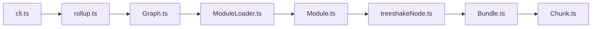

# rollup/rollup

> Bundler JavaScript qui assemble des modules ES en un fichier optimisé, pour auteurs de bibliothèques et d'applications.

## Le problème
Livrer du code modulaire dans des environnements qui ne gèrent pas les modules ES, sans embarquer le code inutilisé.

## Ce que ça fait vraiment
Prend un point d'entrée, résout et analyse les modules, élimine le code non utilisé (tree shaking), puis rend les chunks en iife, cjs, umd ou ES. Utilisable en CLI avec fichier de configuration ou via l'API JavaScript. Les modules CommonJS passent par un plugin ; mode watch inclus.

## Comment c'est branché


## Essayer
```bash
npm install --global rollup
rollup main.js --format iife --name "myBundle" --file bundle.js
rollup main.js --format cjs --file bundle.js
rollup main.js --format umd --name "myBundle" --file bundle.js
```

## Coût et pièges
Gratuit. Le format UMD exige un nom de bundle. L'import de CommonJS dépend d'un plugin séparé.

## Ce que ce n'est pas
Pas un serveur de développement. La licence est présente mais non identifiée par GitHub : à vérifier.

## Alternatives
- webpack : cité dans le README pour la compatibilité des modules publiés.

## Pour toi
Surveiller : utile si tu publies une bibliothèque JS ; sans lien avec la data ou l'IA sinon. Vérifie la licence.

