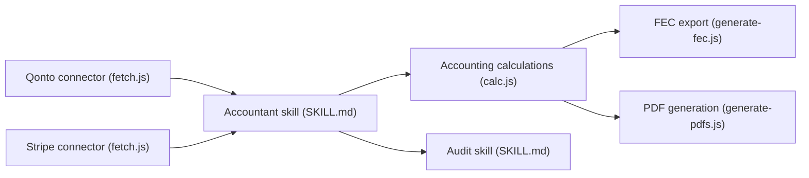

# romainsimon/paperasse

> Six skills Markdown pour agents IA couvrant comptabilité, fiscalité, notariat et copropriété françaises.

## Le problème
Les démarches comptables et fiscales françaises sont denses, changeantes et sources d'erreurs.

## Ce que ça fait vraiment
Six skills (`comptable`, `controleur-fiscal`, `commissaire-aux-comptes`, `fiscaliste`, `notaire`, `syndic`) avec scripts Node et templates : écritures, TVA, clôture annuelle, FEC, liasse, simulation de contrôle DGFIP, calculs d'impôt, frais de notaire. Connecteurs Qonto et Stripe en option. Évaluations avec/sans skill : 88 % contre 75 % en agrégat, mesurées par l'auteur.

## Comment c'est branché


## Essayer
```bash
npm install
cp company.example.json company.json
npm run fetch
npm run closing
uv run --project evals python evals/run_evals.py
```

## Coût et pièges
Les skills tournent avec les clés de ton agent ; Qonto et Stripe demandent des clés d'API. Les skills partageant des liens symboliques cassent à l'import par zip.

## Ce que ce n'est pas
Pas un substitut à un expert-comptable, un CAC ou un notaire (avertissement du dépôt). Les règles fiscales changent : vérifier les chiffres.

## Alternatives
Aucune alternative nommée dans le README (forks paperasse-tn et paperasse-be pour d'autres pays).

## Pour toi
À ignorer pour un profil data/IA : domaine fiscal français très spécifique ; seul le dispositif d'évaluation des skills peut t'inspirer.

