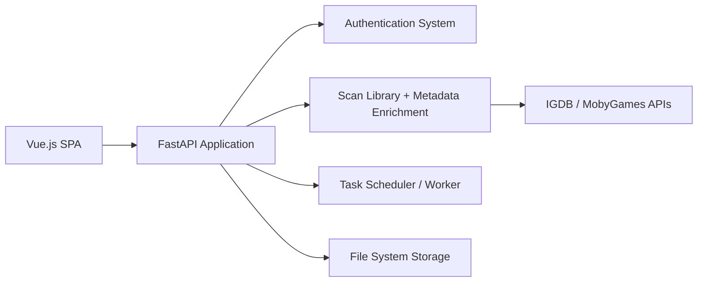

# rommapp/romm

> Gestionnaire et lecteur de ROMs auto-hébergé, avec métadonnées, synchro de sauvegardes et émulation web.

## Le problème
Une collection de ROMs éparpillée est difficile à cataloguer, à enrichir et à jouer depuis plusieurs appareils.

## Ce que ça fait vraiment
SPA Vue.js et backend FastAPI avec PostgreSQL et Redis. Scanne la bibliothèque et l'enrichit via IGDB, Screenshot, LaunchBox, MobyGames, SteamGridDB et RetroAchievements. Lecture dans le navigateur avec EmulatorJS et RuffleRS, synchro des sauvegardes, patcheur de ROM, SSO OIDC et permissions par utilisateur. Applications officielles Playnite, Android, firmwares portables.

## Comment c'est branché

## Essayer
Le README ne contient pas de commande : il renvoie au « Quick Start Guide » de la documentation.

## Coût et pièges
Gratuit, sans suivi ni fonction payante. Métadonnées via des API tierces (clés possibles). Le README affiche un lien d'hébergement Hostinger qui reverse une part de revenus au projet.

## Ce que ce n'est pas
Ne fournit aucune ROM ni BIOS ; le cadre légal reste à ta charge.

## Alternatives
Gaseous, un autre gestionnaire de ROMs avec émulateur web, cité dans « Our Friends ».

## Pour toi
À ignorer : outil de retrogaming sans rapport avec data/IA/MLOps, même s'il est bien construit et sous AGPL-3.0.

