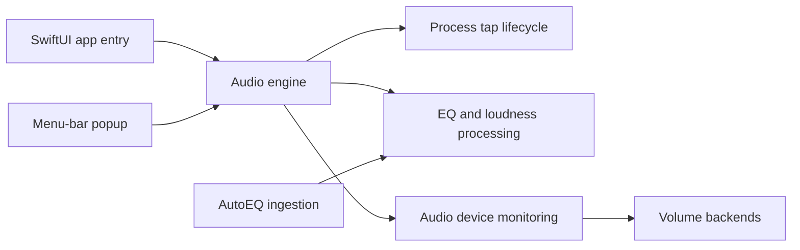

# ronitsingh10/FineTune

> Application macOS de barre de menus qui règle volume, routage et égaliseur par application.

## Le problème
macOS n'offre ni volume par application, ni routage d'une appli vers une sortie précise, ni égaliseur système.

## Ce que ça fait vraiment
Application SwiftUI qui pose des « process taps » Core Audio par processus : volume et boost jusqu'à 4x, routage vers un ou plusieurs périphériques, EQ 10 bandes, correction casque AutoEQ, compensation de loudness ISO 226. Gère priorités de périphériques, DDC des écrans, Bluetooth, raccourcis globaux, touches média et schémas d'URL pour l'automatisation.

## Comment c'est branché


## Essayer
```bash
brew install --cask finetune
git clone https://github.com/ronitsingh10/FineTune.git
cd FineTune
open FineTune.xcodeproj
```

## Coût et pièges
Gratuit ; macOS 15 minimum et permission « Screen & System Audio Recording » obligatoire. 208 issues ouvertes pour un seul auteur.

## Ce que ce n'est pas
Rien à voir avec le fine-tuning de modèles malgré le nom : c'est un utilitaire audio. Aucune version Windows ou Linux.

## Alternatives
Aucune alternative nommée dans le README.

## Pour toi
À ignorer pour la veille data/IA : le nom prête à confusion mais c'est un utilitaire audio macOS, utile seulement comme outil personnel sur ton Mac.
