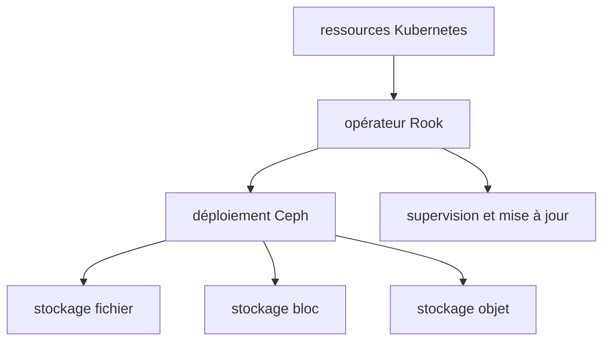

# rook/rook

> Orchestrateur de stockage cloud-native qui intègre Ceph nativement à Kubernetes.

## Le problème
Déployer et exploiter un cluster Ceph à la main sous Kubernetes est une charge d'administration
lourde et facile à rater.

## Ce que ça fait vraiment
Rook automatise le déploiement et la gestion de Ceph pour fournir un stockage auto-géré,
auto-dimensionné et auto-réparant. L'opérateur s'appuie sur les ressources Kubernetes pour
déployer, configurer, provisionner, mettre à l'échelle, mettre à jour et superviser Ceph, lequel
fournit du stockage fichier, bloc et objet. Le statut du fournisseur Ceph est **Stable**, avec
compatibilité ascendante assurée entre versions.

## Comment c'est branché

## Essayer
Aucune commande n'est documentée dans le README : il renvoie à la documentation et au QuickStart
Guide pour l'installation, le déploiement et l'administration.

## Coût et pièges
Gratuit, licence Apache 2.0. Il faut un cluster Kubernetes et la matière disque associée. Le README
recommande fortement de n'utiliser que les versions officielles : les constructions depuis `master`
peuvent changer ou perdre des fonctionnalités à tout moment, sans préavis ni support.

## Ce que ce n'est pas
Ce n'est pas un système de stockage : c'est l'orchestrateur qui pilote Ceph. Ce n'est pas non plus
un produit multi-backend d'après ce README, qui ne décrit que le fournisseur Ceph. Le README est
court et renvoie tout le concret à la documentation externe.

## Alternatives
Aucune alternative n'est nommée dans le README.

## Pour toi
À connaître si ta plateforme data tourne sur Kubernetes auto-hébergé et qu'il te faut du stockage
persistant ; hors de ce cas, c'est le terrain de l'équipe infra.
