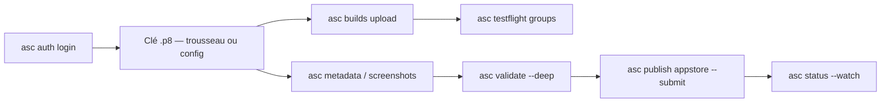

# rorkai/App-Store-Connect-CLI

> CLI Go scriptable pour piloter l'API App Store Connect depuis un terminal ou une CI.

## Le problème
Publier une app Apple passe par une interface web à étapes, difficile à scripter, à rejouer en CI
et à vérifier avant soumission.

## Ce que ça fait vraiment
Couvre le cycle complet : authentification par clé API (avec ou sans trousseau), envoi de builds
`.ipa` ou `.pkg`, groupes TestFlight, retours et crashs, métadonnées et localisations,
captures d'écran par appareil et par langue, signature et profils, bundle IDs, workflows Xcode
Cloud, campagnes Apple Ads et messages de rétention StoreKit. `asc validate` vérifie la
préparation d'une version et signale les résidus de gabarit (`Lorem ipsum`, `TODO`, `TBD`).
Le format de sortie s'adapte : table en terminal, JSON en pipe ou en CI.

## Comment c'est branché


## Essayer
```bash
brew install asc
curl -fsSL https://asccli.sh/install | bash
asc auth login --name "MyApp" --key-id "ABC123" --issuer-id "DEF456" --private-key /path/to/AuthKey.p8 --network
asc auth doctor
asc apps list --output table
asc publish appstore --app "123456789" --ipa "/path/to/MyApp.ipa" --version "1.2.3" --submit --confirm
asc telemetry disable
```

## Coût et pièges
Gratuit, binaires autonomes sans Go requis. **Télémétrie activée par défaut** : version, OS,
chemin de commande, durée, code HTTP en cas d'échec — sans arguments bruts ni identifiants,
désactivable par `asc telemetry disable`, `ASC_TELEMETRY_DISABLED=1` ou `DO_NOT_TRACK=1`. Le mode
`--deep` s'appuie sur des endpoints Apple privés qui peuvent changer sans préavis : une réponse
inattendue donne `unverified`, pas un blocage. `asc signing fetch` ne récupère pas la clé privée.

## Ce que ce n'est pas
Ce n'est pas un outil de build : il orchestre Xcode, il ne le remplace pas. Ce n'est pas un
produit Apple. Le paquet WinGet n'est pas encore accepté.

## Alternatives
- **app-store-connect-cli-skills** : le pack de 25 skills d'agent compagnon, installé par `asc install-skills`.

## Pour toi
Sans objet hors développement iOS/macOS.
