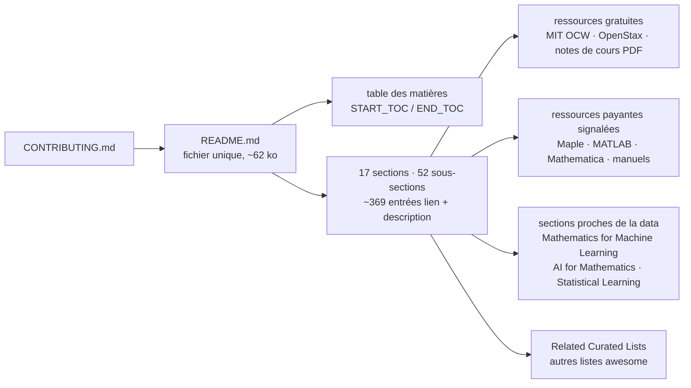

# rossant/awesome-math

> **A link list of mathematics resources, sorted by field, to consult when hunting for a course.**

## The problem

Looking for a measure theory course, a decent linear algebra textbook or a set of lecture notes
on stochastic processes means wading through search results, orphan PDFs on university servers
and video channels of uneven quality, with no way to tell which is freely accessible and which
is a paid book. Without an index of this kind you redo that search for every new topic, and you
also never find out what you don't know: subfields you would not have thought to query never
show up.

## What it actually does

It is a single `README.md` of roughly 62,000 bytes, with no code for the user to run: a table
of contents fenced by `<!-- START_TOC -->` / `<!-- END_TOC -->` markers, then seventeen
top-level sections and fifty-two subsections holding about 369 entries. Each entry is a link
followed by one sentence of description, often with the author and their institution.

The stated coverage runs from pure mathematics to applied mathematics, computation, formal
proof and the use of AI in mathematics: "Start Here" (learning platforms, proof and problem
solving, video courses, questions and answers, reference works), foundations and logic
(including type theory, category theory, formal mathematics and proof assistants), algebra,
number theory, combinatorics, geometry and topology, analysis, differential equations,
probability and statistics, numerical analysis, optimization and control, mathematical physics,
interdisciplinary mathematics (computer science, machine learning, information theory, finance,
biology, signal processing), mathematical practice (AI for mathematics, software and tools),
history and education, then journals, blogs, conferences and related lists.

The editorial rule is written into the README: most resources are free; a paid resource is kept
only when it is widely respected, unusually useful and hard to replace, and the access limit
must then be stated in the entry. That holds in practice — "Paid textbook by Daniel J.
Velleman", "Some solution steps and study features require a paid plan" for Symbolab, and so
on. Contributors are asked to do exactly one thing: read `CONTRIBUTING.md` before suggesting a
resource.

## How it is wired



No code-derived diagram exists for this repository: the graph above is reconstructed from the
README alone. There is not much else to wire anyway — as the README describes it, the
repository is a document plus a contribution-rules file. The `START_TOC` / `END_TOC` markers
suggest the table of contents is generated, but the README documents neither the tool nor the
command that would generate it.

## Trying it

```bash
# no install or run command is documented in the README
```

The README contains no command block at all. The only documented way to use the repository is
to read the page on GitHub and follow the links; the only instruction given is to read
`CONTRIBUTING.md` before suggesting a resource. Nothing has been reconstructed here.

## Cost and traps

- **Nothing to install, nothing to pay for the list itself**: CC0-1.0 in the catalogue, that is
  a public-domain dedication — the content can be copied without constraint.
- **The cost sits in the linked resources**, not in the repository. Several entries are paid and
  the README says so explicitly: Math Academy, "How to Prove It", The Princeton Companion to
  Mathematics, Encyclopedia of Distances, Magma (subscription-based), Maple, MATLAB, Wolfram
  Mathematica, plus advanced features of Symbolab and Wolfram Alpha. Coursera and edX are
  described as varying by course.
- **External links mean link rot.** A large share of entries are PDFs on academic personal
  pages; the README documents no automated link checking.
- **No per-entry assessment.** The README makes no claim of having reviewed the contents, and
  for the `awesome-ai-for-math` list it even states that individual entries require independent
  review. The selection is editorial; the level of each resource is still yours to judge.
- **A one-person repository**: a personal account, with no governance structure described in
  the README — hence the warning kept in the front matter. Contribution goes through outside
  proposals and the maintainer's arbitration.

## What it is not

- **Not a course or a textbook.** Nothing is taught here: there are only links and one sentence
  of description per link. No path, no exercises, no progression, even though some linked
  entries provide them (OSSU Math is cited as a prerequisite-ordered curriculum).
- **Not software, not a library, not a dataset.** The catalogue reports Python as the
  repository language, but the README documents no package, no script and no API: there is
  nothing to import.
- **Not a machine-learning list.** The parts directly useful to a data profile amount to
  "Mathematics for Machine Learning" (four entries), "Statistical Learning", "AI for
  Mathematics" and "Mathematical Software and Tools"; the rest is mathematics for its own sake.
- **Not a guarantee of free access or permanence**: the README says most resources are free,
  not all, and the CC0-1.0 licence covers the list, not what it references.

## Alternatives

| | When to prefer it |
|---|---|
| **seewoo5/awesome-ai-for-math** | Listed in the README under "Related Curated Lists": a research index on AI-assisted mathematical reasoning, discovery, formal proof and related datasets. Prefer it if only the AI × mathematics intersection matters — though the README warns its entries require independent review. |
| **nschloe/awesome-scientific-computing** | Cited by the README: software for numerical analysis, scientific computing, meshing, solvers and visualization. Prefer it when you want tools to install rather than courses to read. |
| **ebrahimpichka/awesome-optimization** | Cited by the README: courses, books, notes and software across mathematical optimization and operations research. Prefer it to dig into that single field, which `awesome-math` covers in one section only. |

The neighbours proposed by the catalogue (`birobirobiro/awesome-shadcn-ui`,
`LiLittleCat/awesome-free-chatgpt`, `vitejs/awesome-vite`, `marcelscruz/public-apis`) are not
comparable: they are lists brought together by the "awesome" format alone, and their subjects —
UI components, free ChatGPT access, the Vite ecosystem, public APIs — have no overlap with
mathematics.

## For you

A bookmark, not a dependency: keep it for the day you need to go back to the measure theory
behind a probability law, find a sound linear algebra textbook, or survey what exists on formal
proof and AI for mathematics (LeanDojo, miniF2F and AlphaGeometry are each referenced with one
sentence). The "Mathematics for Machine Learning" section is short but well targeted. Nothing
here, however, enters a pipeline or an environment: the value is that of a bibliography kept by
one person, with the link rot that comes with it.
