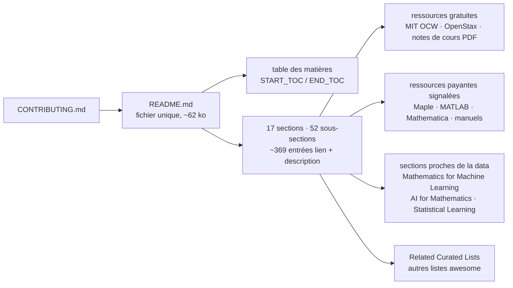

# rossant/awesome-math

> **Une liste de liens vers des ressources de mathématiques, classée par domaine, à consulter quand on cherche un cours.**

## Le problème

Chercher un cours de théorie de la mesure, un manuel d'algèbre linéaire ou un jeu de notes sur
les processus stochastiques revient à écumer des pages de résultats, des PDF orphelins de
serveurs universitaires et des chaînes vidéo de qualité inégale, sans savoir lequel est libre
d'accès et lequel est un livre payant. Sans ce genre d'index, on refait cette recherche à
chaque nouveau sujet, et on ne sait pas non plus ce qu'on ignore : les sous-domaines qu'on
n'aurait pas pensé à interroger n'apparaissent jamais.

## Ce que ça fait vraiment

C'est un unique fichier `README.md` d'environ 62 000 octets, sans code exécutable côté
utilisateur : une table des matières encadrée par des marqueurs `<!-- START_TOC -->` /
`<!-- END_TOC -->`, puis dix-sept sections de premier niveau et cinquante-deux sous-sections,
pour environ 369 entrées. Chaque entrée est un lien suivi d'une phrase de description, et
souvent de l'auteur et de son institution.

La couverture annoncée va des mathématiques pures aux mathématiques appliquées, au calcul, à
la preuve formelle et à l'usage de l'IA en mathématiques : « Start Here » (plateformes
d'apprentissage, preuve et résolution de problèmes, cours vidéo, questions-réponses, ouvrages
de référence), fondements et logique (dont théorie des types, théorie des catégories,
formalisation et assistants de preuve), algèbre, théorie des nombres, combinatoire, géométrie
et topologie, analyse, équations différentielles, probabilités et statistiques, analyse
numérique, optimisation et contrôle, physique mathématique, mathématiques interdisciplinaires
(informatique, apprentissage automatique, théorie de l'information, finance, biologie,
traitement du signal), pratique mathématique (IA pour les mathématiques, logiciels et outils),
histoire et enseignement, puis journaux, blogs, conférences et listes apparentées.

La règle éditoriale est écrite dans le README : la plupart des ressources sont gratuites ; une
ressource payante n'est retenue que si elle est largement reconnue, inhabituellement utile et
difficile à remplacer, et la limite d'accès doit alors être indiquée dans l'entrée. C'est le
cas en pratique — « Paid textbook by Daniel J. Velleman », « Some solution steps and study
features require a paid plan » pour Symbolab, etc. Une seule action est demandée au
contributeur : lire `CONTRIBUTING.md` avant de proposer une ressource.

## Comment c'est branché



Aucun diagramme tiré du code n'existe pour ce dépôt : ce schéma est reconstruit depuis le seul
README. Il n'y a d'ailleurs pas grand-chose d'autre à brancher — le dépôt, tel que le README le
décrit, est un document et un fichier de règles de contribution. Les marqueurs `START_TOC` /
`END_TOC` laissent penser que la table des matières est produite automatiquement, mais le
README ne documente ni l'outil ni la commande qui la génèrent.

## Essayer

```bash
# aucune commande d'installation ou d'exécution n'est documentée dans le README
```

Le README ne contient aucun bloc de commandes. La seule manière documentée d'utiliser le dépôt
est de lire la page sur GitHub et de suivre les liens ; la seule instruction donnée est de lire
`CONTRIBUTING.md` avant de proposer une ressource. Rien n'a été reconstruit ici.

## Coût et pièges

- **Rien à installer, rien à payer pour la liste elle-même** : licence CC0-1.0 au catalogue,
  c'est-à-dire versement au domaine public — le contenu se recopie sans contrainte.
- **Le coût est dans les ressources pointées**, pas dans le dépôt. Plusieurs entrées sont
  payantes et le README l'indique explicitement : Math Academy, « How to Prove It », The
  Princeton Companion to Mathematics, Encyclopedia of Distances, Magma (par abonnement), Maple,
  MATLAB, Wolfram Mathematica, et des fonctions avancées de Symbolab ou Wolfram Alpha. Coursera
  et edX sont décrits comme variables selon le cours.
- **Liens externes = pourrissement de liens.** Une grande partie des entrées sont des PDF sur
  des pages personnelles d'universitaires ; le README ne documente aucun contrôle automatique
  des liens.
- **Aucune évaluation par entrée.** Le README ne promet pas d'avoir relu les contenus, et pour
  la liste `awesome-ai-for-math` il écrit même que les entrées demandent une revue
  indépendante. La sélection est éditoriale, le niveau de chaque ressource reste à juger.
- **Dépôt d'une seule personne** : un compte personnel, sans structure de gouvernance décrite
  dans le README — d'où l'alerte conservée. La contribution passe par des propositions
  extérieures et l'arbitrage du mainteneur.

## Ce que ce n'est pas

- **Ce n'est pas un cours ni un manuel.** Rien n'est enseigné ici : il n'y a que des liens et
  une phrase de description par lien. Aucun parcours, aucun exercice, aucune progression, même
  si certaines entrées pointées en fournissent (OSSU Math est cité comme cursus ordonné par
  prérequis).
- **Ce n'est pas un logiciel, ni une bibliothèque, ni un jeu de données.** Le catalogue indique
  Python comme langage du dépôt, mais le README ne documente aucun paquet, aucun script,
  aucune API : il n'y a rien à importer.
- **Ce n'est pas une liste spécialisée en apprentissage automatique.** Les parties directement
  utiles à un profil data se limitent à « Mathematics for Machine Learning » (quatre entrées),
  « Statistical Learning », « AI for Mathematics » et « Mathematical Software and Tools » ; le
  reste est de la mathématique pour elle-même.
- **Ce n'est pas une garantie de gratuité ni de pérennité** : le README annonce que la plupart
  des ressources sont libres d'accès, pas toutes, et la licence CC0-1.0 porte sur la liste, pas
  sur ce qu'elle référence.

## Alternatives

| | Quand le préférer |
|---|---|
| **seewoo5/awesome-ai-for-math** | Listée dans le README sous « Related Curated Lists » : index de recherche sur le raisonnement mathématique assisté par IA, la découverte, la preuve formelle et les jeux de données associés. À préférer si seul le croisement IA × mathématiques compte — mais le README prévient que ses entrées demandent une revue indépendante. |
| **nschloe/awesome-scientific-computing** | Citée par le README : logiciels d'analyse numérique, calcul scientifique, maillage, solveurs et visualisation. À préférer quand on cherche des outils à installer plutôt que des cours à lire. |
| **ebrahimpichka/awesome-optimization** | Citée par le README : cours, livres, notes et logiciels d'optimisation mathématique et de recherche opérationnelle. À préférer pour creuser ce seul domaine, qu'`awesome-math` ne traite qu'en une section. |

Les voisins proposés par le catalogue (`birobirobiro/awesome-shadcn-ui`,
`LiLittleCat/awesome-free-chatgpt`, `vitejs/awesome-vite`, `marcelscruz/public-apis`) ne sont
pas comparables : ce sont des listes rapprochées par leur seule forme « awesome », et leurs
sujets — composants d'interface, accès gratuits à ChatGPT, écosystème Vite, API publiques —
n'ont aucun recouvrement avec les mathématiques.

## Pour toi

Un signet, pas une dépendance : à garder pour le jour où il faut reprendre la théorie de la
mesure derrière une loi de probabilité, retrouver un manuel d'algèbre linéaire correct, ou
voir ce qui existe côté preuve formelle et IA pour les mathématiques (LeanDojo, miniF2F,
AlphaGeometry y sont référencés avec une phrase chacun). La section « Mathematics for Machine
Learning » est courte mais bien ciblée. En revanche, rien ici n'entre dans un pipeline ni dans
un environnement : la valeur est celle d'une bibliographie tenue par quelqu'un, avec le risque
de liens morts qui va avec.
