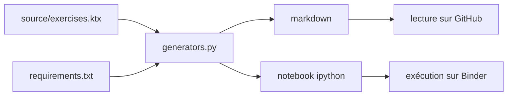

# rougier/numpy-100

> Cent exercices NumPy, utilisables comme aide-mémoire ou comme support de cours.

## Le problème
NumPy s'apprend par la pratique, mais les exercices sont dispersés entre mailing
list, Stack Overflow et documentation.

## Ce que ça fait vraiment
Rassemble cent exercices venus de la mailing list NumPy, de Stack Overflow et de la
documentation, complétés par des exercices écrits par l'auteur pour atteindre la
centaine. Sert à la fois de référence rapide pour les utilisateurs anciens et
nouveaux, et de jeu d'exercices pour ceux qui enseignent. Se lit sur GitHub ou
s'exécute sur Binder. Point notable : le Markdown et le notebook IPython sont
générés programmatiquement depuis `source/exercises.ktx` — le format `ktx` est un
stockage clé-texte minimal et lisible. Modifier le contenu passe donc par la source
puis par `generators.py`.

## Comment c'est branché

## Essayer
Aucune commande d'installation : les exercices se lisent sur GitHub ou s'exécutent
sur Binder. Pour régénérer les fichiers, exécuter le module `generators.py` avec
les bibliothèques de `requirements.txt` installées.

## Coût et pièges
Gratuit, licence MIT. Le seul piège est d'éditer le Markdown ou le notebook
directement : ils sont générés et toute modification sera écrasée.

## Ce que ce n'est pas
Pas un tutoriel progressif ni un cours : une liste d'exercices sans fil pédagogique.
Pas de solutions commentées décrites dans le README. Le dépôt est stable mais porté
par une seule personne.

## Alternatives
- From Python to NumPy : le livre du même auteur, pour des exercices étendus.
- 100 Julia Exercises : la variante Julia.

## Pour toi
Bon matériau si tu dois former quelqu'un à NumPy ; le pattern « source `.ktx` +
`generators.py` » est réutilisable pour tes propres supports générés.
