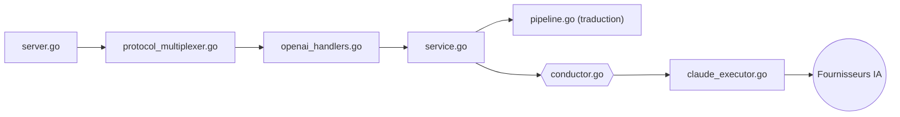

# router-for-me/CLIProxyAPI

> Proxy Go local qui expose tes abonnements CLI (Claude Code, Codex, Gemini, Grok, Kimi) en API compatibles.

## Le problème
Les abonnements Claude Code, Codex ou Gemini CLI ne servent que dans leur propre outil. Pour les brancher sur un autre client ou SDK, il faut une clé d'API payée à part.

## Ce que ça fait vraiment
Serveur Go qui reçoit des requêtes au format OpenAI (Responses compris), Gemini ou Claude, les traduit vers le format du fournisseur cible et les exécute avec des comptes OAuth ou des clés.
Le « conductor » choisit le compte : round-robin multi-comptes, poids, retries, cooldowns, bascule sur quota.
Streaming, WebSocket, outils, images. Config rechargée à chaud par un watcher ; API de gestion ; plugins natifs ; SDK Go embarquable.
Plus de statistiques d'usage intégrées depuis la v6.10.0 : il faut un projet tiers (CPA Usage Keeper, CPA-Manager-Plus).

## Comment c'est branché


## Essayer
```bash
# Aucune commande documentée dans le README :
# l'installation renvoie au guide https://help.router-for.me/
```

## Coût et pièges
Le proxy est gratuit, mais chaque compte branché est un abonnement ou une clé à ta charge. Le README renvoie (via le projet WebBrain) à un guide sur le « risque de compte » : mutualiser des abonnements derrière un proxy n'est pas neutre vis-à-vis des fournisseurs.

## Ce que ce n'est pas
Pas un fournisseur de modèles : sans compte chez OpenAI, Anthropic, Google, xAI ou Moonshot, il ne sert à rien.
Pas un tableau de bord : suivi d'usage et coûts sont délégués à des projets tiers.
Redis et PostgreSQL sont optionnels mais apparaissent dès qu'on passe en cluster.

## Alternatives
- 9Router : réimplémentation Next.js avec tableau de bord web et fallback automatique.
- OmniRoute : passerelle orientée routage vers des modèles gratuits ou bon marché, avec quotas et cache.
- Codex Switch : si tu veux seulement alterner entre comptes Codex, sans proxy.

## Pour toi
Pratique pour tester tes agents sur plusieurs modèles avec tes abonnements existants ; pas pour un usage d'équipe.
