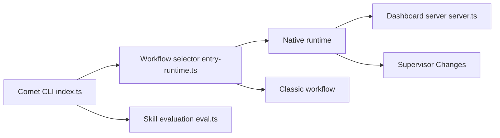

# rpamis/comet

> Plateforme de workflows reprenables pour agents de code, avec création et évaluation de skills.

## Le problème
Les tâches longues d'un agent de code perdent l'état à chaque interruption, et les skills s'améliorent à l'intuition plutôt que par mesure.

## Ce que ça fait vraiment
Deux workflows indépendants : Native (le modèle choisit la méthode, Comet gère l'état, la vérification et l'archivage) et Classic (cinq phases OpenSpec + Superpowers avec machine à états et scripts de garde). Les « Supervisor Changes » découpent un objectif en sous-changements sur des worktrees isolés. S'y ajoutent mémoire personnelle, connaissance projet, tableau de bord et `comet eval` (rubrique, Pass@k, Pass^k, LangSmith).

## Comment c'est branché


## Essayer
```bash
npm install -g @rpamis/comet
cd your-project
comet init
comet init --workflow classic
```
Puis invoquer `/comet` dans l'hôte.

## Coût et pièges
Node.js 22.16+ ou 24+, npm et Git. Les gains annoncés (76,8 % de tokens en moins) viennent d'une expérience des auteurs sur 16 tâches ; conditions et limites dans leur rapport.

## Ce que ce n'est pas
Pas un agent en soi : il orchestre des agents existants (Codex, Claude Code). Native et Classic ne sont pas des paliers l'un de l'autre.

## Alternatives
- OpenSpec et Superpowers : composants de la méthode Classic.

## Pour toi
À surveiller : intéressant pour structurer des sessions longues avec mesure des skills, mais jeune (créé en mai 2026) et lourd à adopter.

