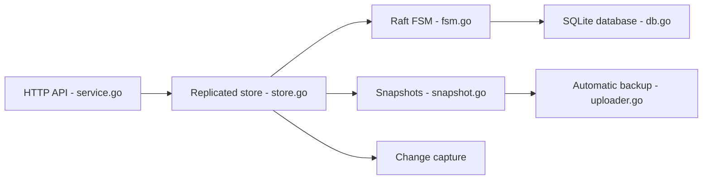

# rqlite/rqlite

> Base de données relationnelle distribuée et tolérante aux pannes, construite sur SQLite, pilotée en HTTP.

## Le problème
SQLite n'est pas répliqué ; on veut un petit magasin relationnel hautement disponible sans lourde installation.

## Ce que ça fait vraiment
Un binaire unique expose une API HTTP : les requêtes passent par un store répliqué (consensus Raft) puis le FSM applique à SQLite. Fonctions : SQL complet (recherche plein texte, JSON), extensions SQLite (recherche vectorielle), requêtes atomiques, capture de changements, clustering dynamique (Kubernetes, Consul, etcd, DNS), sauvegardes à chaud vers S3/GCS, TLS, cohérence de lecture réglable.

## Comment c'est branché


## Essayer
```bash
docker run -p 4001:4001 rqlite/rqlite
curl -XPOST 'localhost:4001/db/execute?pretty' -H 'Content-Type: application/json' -d '[
     "CREATE TABLE foo (id INTEGER NOT NULL PRIMARY KEY, name TEXT)",
     "INSERT INTO foo(id, name) VALUES(1, \"fiona\")"
]'
curl -G 'localhost:4001/db/query?pretty' --data-urlencode 'q=SELECT * FROM foo'
```

## Coût et pièges
Gratuit. Gouvernance non précisée dans le README (projet associé à un auteur principal, déduit du nom). Le débit d'écriture reste limité par la réplication.

## Ce que ce n'est pas
Pas un remplaçant de PostgreSQL pour de gros volumes ou du transactionnel intensif. C'est « etcd avec du relationnel » selon le README.

## Alternatives
Aucune alternative nommée dans le README (etcd est cité en comparaison).

## Pour toi
À surveiller : pratique pour un petit magasin de métadonnées répliqué en edge ou Kubernetes ; à éviter pour de l'analytique.

