# rs/zerolog

> Logger structuré JSON pour Go, à API chaînée, pour services Go sensibles aux allocations.

## Le problème
Les loggers Go classiques passent par la réflexion et allouent à chaque événement, ce qui pèse sur les chemins chauds.
Sans typage des champs, le JSON produit est incohérent et difficile à interroger en aval.

## Ce que ça fait vraiment
Écrit des événements JSON (ou CBOR avec le build tag `binary_log`) via une chaîne `log.Info().Str(...).Msg(...)`.
Champs typés (`Str`, `Int`, `Dur`, `Dict`, `RawJSON`, `IPAddr`…), sous-loggers, hooks, échantillonnage (`BasicSampler`, `BurstSampler`).
Intégrations fournies : `net/http` via `hlog`, `log/slog` via `NewSlogHandler`, stacktraces via `pkgerrors`.
`ConsoleWriter` donne une sortie lisible en développement, au prix de la performance ; `diode.Writer` découple un writer lent.

## Comment c'est branché

```mermaid
flowchart TD
  A[log.Info&#40;&#41; chaîne d'appels] --> B[zerolog.Event champs typés]
  B --> C[Hooks + Sampler]
  C --> D[Encodeur JSON ou CBOR]
  D --> E[io.Writer os.Stderr]
  D --> F[zerolog.ConsoleWriter]
  D --> G[diode.Writer non bloquant]
  H[hlog / NewSlogHandler] --> A
```


## Essayer
```bash
go get -u github.com/rs/zerolog/log
go build -tags binary_log .
```

## Coût et pièges
Gratuit, aucune clé ni service. Piège de code : oublier `Msg`/`Msgf` en fin de chaîne fait disparaître l'événement sans erreur de compilation.
Niveau global par défaut = `trace`, donc tout part sur stderr tant qu'on n'appelle pas `SetGlobalLevel`. `Msgf` alloue même logger désactivé.

## Ce que ce n'est pas
Pas un collecteur ni un backend de logs : ça écrit dans un `io.Writer`, la suite est à votre charge.
Pas un logger pour console humaine — `ConsoleWriter` est annoncé comme inefficace.
Pas un remplaçant de `slog` : c'est l'inverse, il fournit un handler pour `slog`.

## Alternatives
- uber-go/zap : approche pionnière citée par le README, moins d'allocations sur certains cas mesurés.
- logrus : API plus simple, coût par événement bien supérieur d'après les tableaux du README.
- go-kit/log : si vous êtes déjà dans l'écosystème go-kit.

## Pour toi
Utile seulement si tu écris des services ou exporters en Go ; côté Python/MLOps, ça ne te concerne pas.
