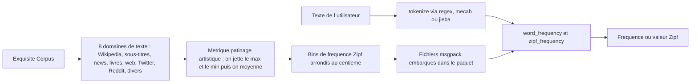

# rspeer/wordfreq

> **A frozen table of word frequencies in 40+ languages, queried offline from Python.**

## The problem

Deciding whether a word is common or rare normally means gathering corpora, tokenising them
consistently and reconciling sources that disagree. Without that, you end up counting on a
single corpus, biased by its domain and not comparable across languages. The README also states
the reverse problem: the author writes that the world in which she had a reasonable way to
collect reliable word frequencies no longer exists, and points to `SUNSET.md`.

## What it actually does

`word_frequency(word, lang)` returns a frequency between 0 and 1; `zipf_frequency` returns the
same thing on a base-10 logarithmic scale (Zipf 6 means once per thousand words). Two list
sizes: 'small' (words appearing at least once per million) and 'large' (once per hundred
million, available for 14 languages), with 'best' picking between them. Around that:
`tokenize`, `top_n_list`, `iter_wordlist`, `get_frequency_dict`, `available_languages`,
`get_language_info`, `random_words` and `random_ascii_words`. Numbers are not stored one by
one: they are grouped by "shape" (`##`, `####`), then reweighted by Benford's law and, for
4-digit sequences, by a year distribution that plateaus from 2019 to 2039. Frequencies are
rounded into Zipf bins at the hundredth, which gives 1% precision — explicitly not a claim of
accuracy.

## How it is wired



The data comes from Exquisite Corpus, a Luminoso project aggregating eight text domains. For
each word, wordfreq drops the source giving the highest frequency and the one giving the
lowest, averages the rest and rescales — hence the figure-skating analogy. On the lookup side,
a query first goes through tokenisation (`regex` following Unicode Annex #29,
`mecab-python3` for Japanese and Korean, `jieba` for Chinese), then the table. Serbian is
transliterated to Latin and Chinese converted to "Oversimplified Chinese" to unify Traditional
and Simplified. `langcodes` maps a specific code such as `cmn-Hans` onto `zh`.

## Trying it

```bash
pip3 install wordfreq
# or, for development, from the repository:
poetry install
# Chinese, Japanese, Korean:
pip install wordfreq[cjk]
```

```python
>>> from wordfreq import word_frequency, zipf_frequency, top_n_list
>>> word_frequency('cafe', 'en')
1.23e-05
>>> zipf_frequency('the', 'en')
7.73
>>> top_n_list('en', 10)
['the', 'to', 'and', 'of', 'a', 'in', 'i', 'is', 'for', 'that']
```

## Cost and traps

Free, no key, no third-party service: the lists ship inside the package and usage is fully
offline. The real cost is elsewhere. The data is a snapshot of usage through about 2021 and is
unlikely to be updated again. Japanese and Korean need `mecab-python3`, whose compilation
requires the `libmecab-dev` system package; Chinese needs `jieba`. The code is Apache-licensed,
but the data files are CC-BY-SA 4.0, plus Google Books Ngrams terms and a personal agreement
Robyn Speer obtained from Marc Brysbaert for the SUBTLEX lists, which requires crediting the
SUBTLEX authors. GitHub reports the licence as `NOASSERTION`, which reflects that mix: check it
before redistributing. The author also explicitly refuses CSV export, because that format
carries neither attribution nor licence.

## What it is not

It is not a corpus or a raw dataset to export: the README says no to CSV and points out the
frequencies are not separable from the normalisation and segmentation code that produces them.
It is not a measure of today's language: nothing after about 2021. It is not a sentence scorer
either — querying "New York" or a rare combination goes through a half-harmonic-mean that
assumes the words often co-occur, and badly over-estimates unlikely pairs
(`zipf_frequency('owl-flavored', 'en')` returns 3.3). Finally, the stated 1% figure is about
precision, not accuracy, which the author says she does not know how to measure.

## Alternatives

The README names no competing library, and no catalogue neighbour is comparable. It does name
its sources and relatives: the **SUBTLEX** lists by Brysbaert et al., usable directly if you
only want subtitle frequencies for a few languages; **LuminosoInsight/exquisite-corpus**, the
upstream pipeline, if you would rather rebuild your own lists than consume the snapshot; and
**beala/xkcd-password** (`xkpa`), preferable to `random_ascii_words` for generating a memorable
passphrase.

## For you

Useful as a frozen, citable reference — a Zenodo DOI is provided — to weight lexical features,
filter rare words, calibrate readability tests or evaluate multilingual text without depending
on an API. Skip it as soon as recent usage is the object of study: the data stops around 2021
and the project is declared sunset.
