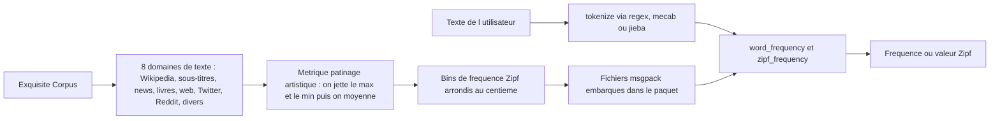

# rspeer/wordfreq

> **Table figée de fréquences lexicales en 40+ langues, interrogeable hors ligne depuis Python.**

## Le problème

Savoir si un mot est courant ou rare demande normalement de rassembler des corpus, de les
tokeniser de façon cohérente et de réconcilier des sources qui se contredisent. Sans ça, on
bricole un comptage sur un seul corpus, biaisé par son domaine, et non comparable d'une langue
à l'autre. Le README pose le problème inverse aussi : l'auteure écrit que le monde où l'on
pouvait collecter des fréquences fiables n'existe plus, et renvoie à `SUNSET.md`.

## Ce que ça fait vraiment

`word_frequency(mot, lang)` renvoie une fréquence entre 0 et 1 ; `zipf_frequency` renvoie la
même chose sur une échelle logarithmique base 10 (Zipf 6 = une fois pour mille mots). Deux
tailles de listes : 'small' (mots apparaissant au moins une fois par million) et 'large' (une
fois par cent millions, disponible pour 14 langues), 'best' choisissant l'une ou l'autre.
Autour : `tokenize`, `top_n_list`, `iter_wordlist`, `get_frequency_dict`, `available_languages`,
`get_language_info`, `random_words` et `random_ascii_words`. Les nombres ne sont pas stockés un
par un : ils sont regroupés par « forme » (`##`, `####`), puis repondérés par la loi de Benford
et, pour les séquences de 4 chiffres, par une distribution d'années en plateau de 2019 à 2039.
Les fréquences sont arrondies en bins Zipf au centième, soit une précision — pas une exactitude
— de 1 %.

## Comment c'est branché



Les données viennent d'Exquisite Corpus, un projet Luminoso qui agrège huit domaines de texte.
Pour chaque mot, wordfreq écarte la source qui donne la fréquence la plus haute et celle qui
donne la plus basse, moyenne le reste, puis renormalise — d'où l'analogie avec le patinage.
Côté lecture, la requête passe d'abord par la tokenisation (`regex` suivant l'annexe Unicode
#29, `mecab-python3` en japonais et coréen, `jieba` en chinois), puis par la table. Le serbe
est translittéré en latin et le chinois converti en « chinois oversimplifié » pour unifier
traditionnel et simplifié. `langcodes` rabat un code précis comme `cmn-Hans` sur `zh`.

## Essayer

```bash
pip3 install wordfreq
# ou, pour le développement, depuis le dépôt :
poetry install
# chinois, japonais, coréen :
pip install wordfreq[cjk]
```

```python
>>> from wordfreq import word_frequency, zipf_frequency, top_n_list
>>> word_frequency('cafe', 'en')
1.23e-05
>>> zipf_frequency('the', 'en')
7.73
>>> top_n_list('en', 10)
['the', 'to', 'and', 'of', 'a', 'in', 'i', 'is', 'for', 'that']
```

## Coût et pièges

Gratuit, aucune clé, aucun service tiers : les listes sont embarquées dans le paquet et
l'usage est entièrement hors ligne. Le vrai coût est ailleurs. Les données sont un instantané
de l'usage jusqu'à ~2021 et ne seront vraisemblablement plus mises à jour. Le japonais et le
coréen exigent `mecab-python3`, dont la compilation demande le paquet système `libmecab-dev` ;
le chinois exige `jieba`. Le code est sous Apache, mais les fichiers de données sont sous
CC-BY-SA 4.0, avec en plus les conditions de Google Books Ngrams et un accord nominatif obtenu
par Robyn Speer auprès de Marc Brysbaert pour les listes SUBTLEX — qui impose de créditer les
auteurs SUBTLEX. La licence déclarée côté GitHub est `NOASSERTION`, ce qui reflète ce mélange :
à vérifier avant redistribution. Enfin, l'auteure refuse explicitement l'export CSV, parce que
ce format ne porte ni attribution ni licence.

## Ce que ce n'est pas

Ce n'est pas un corpus ni un dataset brut qu'on exporterait : le README dit non au CSV et
rappelle que les fréquences ne sont pas séparables du code de normalisation et de segmentation
qui les produit. Ce n'est pas une mesure de la langue d'aujourd'hui : rien après ~2021. Ce
n'est pas non plus un scoreur de phrases — interroger « New York » ou une combinaison rare
passe par une moyenne semi-harmonique qui suppose que les mots vont souvent ensemble, et
surestime massivement les combinaisons improbables (`zipf_frequency('owl-flavored', 'en')`
renvoie 3.3). Enfin, la précision de 1 % annoncée porte sur la précision, pas sur l'exactitude,
que l'auteure dit ne pas savoir mesurer.

## Alternatives

Le README ne propose pas de bibliothèque concurrente, et aucun voisin du catalogue n'est
comparable. Il nomme en revanche ses sources et ses cousins : les listes **SUBTLEX** de
Brysbaert et al., utilisables directement si l'on ne veut que des fréquences de sous-titres sur
quelques langues ; **LuminosoInsight/exquisite-corpus**, le pipeline amont, si l'on veut
reconstruire ses propres listes plutôt que consommer l'instantané ; et **beala/xkcd-password**
(`xkpa`), à préférer à `random_ascii_words` pour générer un mot de passe mémorisable.

## Pour toi

Pratique comme référentiel figé et citable — DOI Zenodo fourni — pour pondérer des features
lexicales, filtrer des mots rares, calibrer des tests de lisibilité ou évaluer du texte
multilingue sans dépendre d'une API. À écarter dès que l'objet d'étude est l'usage récent :
les données s'arrêtent vers 2021 et le projet est déclaré en fin de vie.
