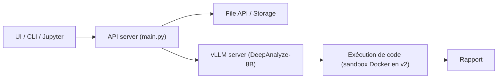

# ruc-datalab/DeepAnalyze

> Modèle 8B et code de démonstration pour automatiser une analyse de données jusqu'au rapport.

## Le problème
Enchaîner préparation, analyse, modélisation, visualisation et rédaction d'un rapport sur des fichiers hétérogènes reste manuel.

## Ce que ça fait vraiment
Un modèle DeepAnalyze-8B, servi par vLLM, reçoit une consigne et des fichiers (CSV, Excel, JSON, bases…), génère et exécute du code, puis produit un rapport. Le dépôt fournit une API compatible OpenAI (`API/`), une interface web (v1 et v2 avec bac à sable Docker), une CLI, une interface Jupyter, ainsi que les piles d'entraînement ms-swift et SkyRL et des bancs d'évaluation.

## Comment c'est branché


## Essayer
```bash
conda create -n deepanalyze python=3.12 -y
conda activate deepanalyze
pip install -r requirements.txt
vllm serve DeepAnalyze-8B
python API/start_server.py
```

## Coût et pièges
GPU requis (de 16 Go en quantifié 4 bits à 80 Go pour le modèle complet). Le code généré est exécuté : la v2 propose un bac à sable Docker. Une clé d'API hébergée est disponible sur demande par formulaire.

## Ce que ce n'est pas
Pas un agent fiable en aveugle : le modèle n'a que 8 milliards de paramètres et les auteurs acceptent des cas où il fait moins bien que les modèles fermés.

## Alternatives
Aucune alternative nommée dans le README.

## Pour toi
À surveiller : pertinent pour tester un agent de data science local et open source, mais à isoler dans un bac à sable et à confronter à tes propres jeux de données.
