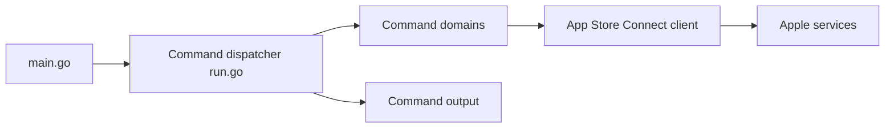

# rudrankriyam/App-Store-Connect-CLI

> CLI Go (`asc`) pour automatiser les sorties iOS/macOS sur App Store Connect depuis le terminal ou la CI.

## Le problème
Publier une app (builds, TestFlight, métadonnées, signature) via l'interface web est manuel et peu scriptable.

## Ce que ça fait vraiment
Appelle l'API App Store Connect (plus Apple Ads et StoreKit) : liste des apps, upload de builds, groupes TestFlight, métadonnées, captures, validation avant soumission, signature. Sort en table dans un terminal et en JSON en pipe. Installe aussi 25 skills d'agent.

## Comment c'est branché


## Essayer
```bash
brew install asc
asc auth login --name "MyApp" --key-id "ABC123" --issuer-id "DEF456" --private-key /path/to/AuthKey.p8 --network
asc apps list --output table
```

## Coût et pièges
Clé API Apple (compte développeur payant). Télémétrie pseudonyme active par défaut : `asc telemetry disable` ou `DO_NOT_TRACK=1`.

## Ce que ce n'est pas
Pas un outil généraliste : réservé à l'écosystème Apple.

## Alternatives
Aucune alternative nommée dans le README.

## Pour toi
À ignorer en data/IA : utile seulement si tu publies des apps iOS.

