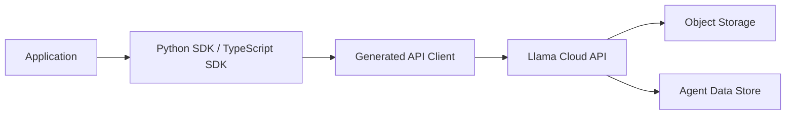

# run-llama/llama_cloud_services

> SDK Python et TypeScript, déclaré obsolète, pour les API cloud de LlamaIndex (parsing, extraction, index).

## Le problème
Le dépôt donnait accès aux services cloud de LlamaIndex depuis une application. Il est aujourd'hui remplacé par de nouveaux paquets.

## Ce que ça fait vraiment
Le README ne contient qu'un avis de dépréciation (fiche minimale, matière insuffisante). Il annonce une maintenance jusqu'au 1er mai 2026 et renvoie vers `llama-cloud>=1.0` (Python) et `@llamaindex/llama-cloud` (TypeScript). D'après le code, le dépôt regroupait des clients pour l'envoi de fichiers, le parsing, l'extraction, la classification, la récupération sur index, les feuilles de calcul et les données d'agents.

## Comment c'est branché


## Essayer
```bash
pip install llama-cloud>=1.0
npm install @llamaindex/llama-cloud
```
Ces commandes installent les paquets de remplacement, seules commandes du README.

## Coût et pièges
Il faut une clé d'API Llama Cloud ; la tarification n'est pas documentée ici. La date de fin de maintenance annoncée (1er mai 2026) est dépassée : le dernier push date du 18 mai 2026.

## Ce que ce n'est pas
Ce n'est plus le dépôt à suivre : l'avis demande de migrer. Le catalogue ne le marque pas comme archivé, mais il n'y a pas de raison d'en dépendre. Il ne fonctionne qu'avec le service hébergé.

## Alternatives
- `llama-cloud` (Python) : paquet de remplacement indiqué par le README.
- `@llamaindex/llama-cloud` (TypeScript) : idem côté npm.

## Pour toi
À ignorer : le README lui-même demande de migrer vers les nouveaux paquets, et ce dépôt n'est plus maintenu.
