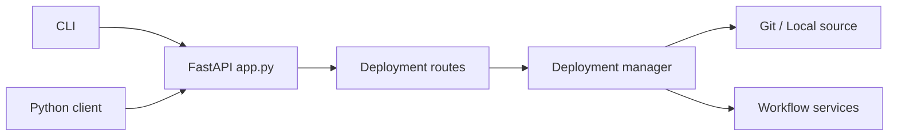

# run-llama/llama_deploy

> Plateforme de déploiement de workflows LlamaIndex, désormais obsolète et remplacée par llama-agents.

## Le problème
Servir des workflows d'agents comme services avec tâches et sessions.

## Ce que ça fait vraiment
Le README tient en un avertissement : le projet est obsolète, utiliser llama-agents. D'après le code : un serveur FastAPI avec routes de déploiement et d'état, un gestionnaire lisant la config et récupérant les sources (Git ou local), des services de workflow, un client Python, une CLI, métriques et traçage.

## Comment c'est branché

## Essayer
Aucune commande documentée dans le README.

## Coût et pièges
Aucun coût propre, mais aucune maintenance attendue : projet déprécié.

## Ce que ce n'est pas
Pas un projet vivant. Dernier push en avril 2026.

## Alternatives
llama-agents : nommé dans le README comme remplaçant.

## Pour toi
À ignorer : le projet est déclaré obsolète par son éditeur, passe directement à llama-agents.

