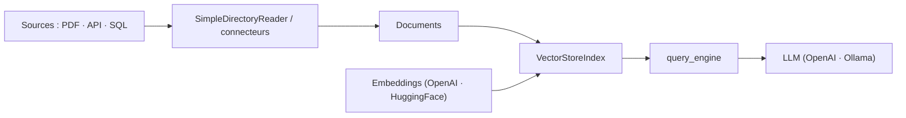

# run-llama/llama_index

> Framework open source d'applications agentiques sur données privées : ingestion, index, requête.

## Le problème
Un LLM est entraîné sur des données publiques. Brancher les tiennes suppose connecteurs, découpage, indexation et récupération — à recoder autrement à chaque source.

## Ce que ça fait vraiment
Fournit des connecteurs de données (API, PDF, documents, SQL), des façons de structurer ces données en index et graphes, et une interface de récupération et de requête au-dessus. Deux entrées : `llama-index`, paquet de démarrage avec une sélection d'intégrations, ou `llama-index-core` plus les intégrations choisies parmi plus de 300. La convention de nommage est explicite : un import contenant `core` vise le cœur, sans `core` il vise une intégration.

## Comment c'est branché


## Essayer
```bash
pip install llama-index-core
pip install llama-index-llms-openai
pip install llama-index-embeddings-huggingface
```

## Coût et pièges
La bibliothèque est gratuite ; les appels LLM et embeddings sont à ta charge (`OPENAI_API_KEY`), sauf à passer par Ollama et HuggingFace en local. Par défaut les données sont en mémoire : `index.storage_context.persist()` écrit sur disque. `llama-index-core` embarque un dossier `_static` (caches nltk et tiktoken), vérifiable via `gh attestation verify`.

## Ce que ce n'est pas
Attention au signal d'orientation : le README annonce que le **focus principal de l'entreprise s'est déplacé** vers LlamaParse, liteparse et les benchmarks ; le framework OSS reste disponible « comme boîte à outils ouverte ». LlamaParse, LlamaAgents, Extract et Index sont des produits séparés, sur inscription et clé d'API. Le README n'est pas mis à jour aussi souvent que la documentation.

## Alternatives
- LangChain, Flask, Docker : cités comme cadres applicatifs avec lesquels s'intégrer, pas comme substituts.

## Pour toi
À surveiller : toujours utilisable pour du RAG, mais le déplacement d'attention vers LlamaParse est à intégrer dans ta décision.
