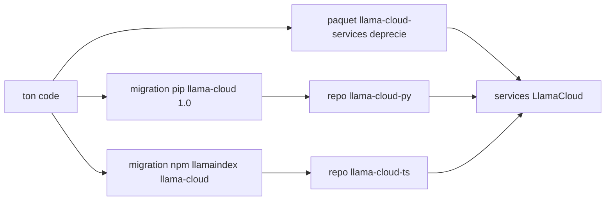

# run-llama/llama_parse

> **Deprecated LlamaCloud client; the README exists only to send you to its successors.**

## The problem

The README states no functional problem: it is a deprecation notice and nothing else.
Without it you would keep installing a package whose support ends on 1 May 2026.

## What it actually does

Not determinable from this README: no function, API or example is documented.
The repository is titled "Llama Cloud Services" and ships the PyPI package
`llama-cloud-services` (PyPI downloads badge), so a client for LlamaCloud services.
The only prose is the migration notice pointing to `llama-cloud>=1.0` for Python and
`@llamaindex/llama-cloud` for TypeScript, described as offering "the same functionality".
That equivalence claim comes from the README and cannot be checked from here.

## How it is wired



Reading: this repository is a way station. No internal module or file is exposed by the
README; the only documented edges are the two migration paths to the new packages, which
target the same LlamaCloud services.

## Trying it

```bash
pip install llama-cloud>=1.0
npm install @llamaindex/llama-cloud
```

These are the only commands in the README, and they install the **replacement** packages:
no install or usage command for this repository itself is documented.

## Cost and traps

The main trap is the date: maintenance is announced only until 1 May 2026, so any new
integration is immediate debt. The README says nothing about pricing, quotas, or whether an
API key or LlamaCloud account is required — undocumented here, check elsewhere.
No licence is declared in the material provided.

## What it is not

Not a repository to evaluate technically: no usage documentation remains.
Not the standalone `llama_parse` package the repo name suggests either — the README speaks of
"Llama Cloud Services", a wider bundle, and redirects elsewhere.
Not a local library: the name and packages point at a hosted service.

## Alternatives

The two successors named in the README: `run-llama/llama-cloud-py` for Python and
`run-llama/llama-cloud-ts` for TypeScript — active development lives there, pick the one
matching your language. None of the catalogue neighbours is comparable to a LlamaCloud client.

## For you

Ignore it as a repository: the only useful takeaway for a data/AI profile is to rename the
dependency if `llama-cloud-services` is still sitting in a `requirements.txt`, and go straight
to the successor package.
