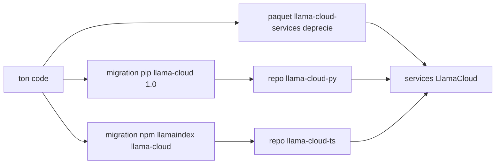

# run-llama/llama_parse

> **Ancien client LlamaCloud, déprécié, remplacé par des paquets neufs à installer à la place.**

## Le problème

Le README ne décrit aucun problème fonctionnel : il ne contient qu'un avis de dépréciation.
Sans lui, on continuerait d'installer un paquet dont le support s'arrête au 1er mai 2026.

## Ce que ça fait vraiment

Impossible à dire depuis ce README : il ne documente ni fonction, ni API, ni exemple.
Le dépôt s'appelle « Llama Cloud Services » et distribue le paquet PyPI `llama-cloud-services`
(badge de téléchargements PyPI), donc un client de services LlamaCloud.
Le seul contenu rédactionnel est la consigne de migration vers `llama-cloud>=1.0` (Python)
ou `@llamaindex/llama-cloud` (TypeScript), annoncés comme offrant « la même fonctionnalité ».
Cette formulation d'équivalence vient du README, elle n'est vérifiable nulle part ici.

## Comment c'est branché



Lecture : ce dépôt est une étape intermédiaire. Le README n'expose aucun module ni fichier
interne ; les seules arêtes documentées sont les deux chemins de migration vers les nouveaux
paquets, qui visent les mêmes services côté LlamaCloud.

## Essayer

```bash
pip install llama-cloud>=1.0
npm install @llamaindex/llama-cloud
```

Ce sont les seules commandes du README, et ce sont celles des **paquets de remplacement** :
aucune commande d'installation ou d'usage du dépôt courant n'est documentée.

## Coût et pièges

Le piège principal est la date : maintenance annoncée jusqu'au 1er mai 2026, donc toute
intégration neuve est une dette immédiate. Le README ne dit rien du prix, du quota, ni de la
nécessité d'une clé d'API ou d'un compte LlamaCloud — non documenté ici, à vérifier ailleurs.
La licence n'est pas déclarée dans la matière fournie.

## Ce que ce n'est pas

Ce n'est pas un dépôt à évaluer techniquement : il n'y a plus de documentation d'usage.
Ce n'est pas non plus le paquet `llama_parse` autonome que le nom du dépôt laisse attendre —
le README parle de « Llama Cloud Services », un ensemble plus large, et redirige ailleurs.
Ce n'est pas une bibliothèque locale : le nom et les paquets pointent vers un service hébergé.

## Alternatives

Les deux successeurs nommés dans le README : `run-llama/llama-cloud-py` pour Python et
`run-llama/llama-cloud-ts` pour TypeScript — c'est là que va le développement actif, choisir
celui qui correspond à ton langage. Aucun des voisins du catalogue n'est comparable à un
client LlamaCloud.

## Pour toi

À ignorer en tant que dépôt : la seule information utile pour un profil data/IA est de
renommer l'import si `llama-cloud-services` traîne dans un `requirements.txt`, et de partir
directement sur le paquet successeur.
