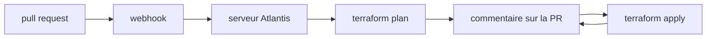

# runatlantis/atlantis

> Application Go auto-hébergée qui exécute Terraform depuis les pull requests et commente le résultat.

## Le problème
Quand chaque ingénieur lance `terraform apply` depuis son poste, personne ne voit le plan avant l'application et les états divergent.

## Ce que ça fait vraiment
Écoute les événements de pull request Terraform via webhooks.
Exécute `terraform plan`, `import` et `apply` à distance.
Republie la sortie en commentaire sur la pull request.
Rend les changements Terraform visibles à toute l'équipe et standardise le workflow.

## Comment c'est branché

## Essayer
Aucune commande d'installation n'est documentée dans le README : il renvoie vers www.runatlantis.io/guide et vers les releases GitHub.

## Coût et pièges
Gratuit. Il faut héberger le serveur, lui donner accès au dépôt et aux credentials cloud — ce qui en fait une cible sensible. Le README ne détaille ni la configuration ni les prérequis.

## Ce que ce n'est pas
Pas un service hébergé ni un remplaçant de Terraform Cloud : tu opères le serveur toi-même. Le README est volontairement minimal et renvoie tout à la documentation externe. Il n'indique pas quelles forges sont supportées.

## Alternatives
Aucune alternative nommée dans le README.

## Pour toi
Pertinent seulement si tu gères de l'infra Terraform en équipe ; sans ça, hors sujet pour un profil data.
