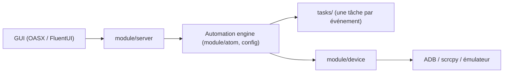

# runhey/OnmyojiAutoScript

> Robot d'automatisation des tâches quotidiennes du jeu mobile Onmyoji, dérivé d'AzurLaneAutoScript.

## Le problème
Les tâches répétitives du jeu (quotidiennes, hebdomadaires, événements) prennent du temps chaque jour.

## Ce que ça fait vraiment
Exécute une longue liste de tâches du jeu par reconnaissance d'image et OCR (ppocr-onnx), avec ordonnanceur de tâches. D'après l'architecture : moteur Python (atome, configuration pydantic), couche appareil (ADB, scrcpy) et interface graphique séparée (FluentUI/QML, OASX en Flutter). Un modèle d'IA gère un mode particulier du jeu. README en chinois.

## Comment c'est branché


## Essayer
```bash
# Aucune commande documentée dans le README : installation via les pages
# « Installation » et « Manuel » du site de documentation (liens non repris).
```

## Coût et pièges
Gratuit. Émulateur ou appareil Android requis (d'après l'architecture). Accès au groupe QQ soumis à des conditions de compte. Les auteurs demandent de ne pas en faire de publicité, les joueurs étant hostiles aux scripts. L'usage peut contrevenir aux règles du jeu (non documenté).

## Ce que ce n'est pas
Pas un outil généraliste d'automatisation d'interface. Le README précise qu'il est fourni sans garantie, les auteurs déclinant toute responsabilité.

## Alternatives
AzurLaneAutoScript (Alas), StarRailCopilot, MAA, FGO-py : projets voisins listés, pour d'autres jeux.

## Pour toi
À ignorer : automatisation d'un jeu précis, sans lien avec la donnée ou l'IA.

