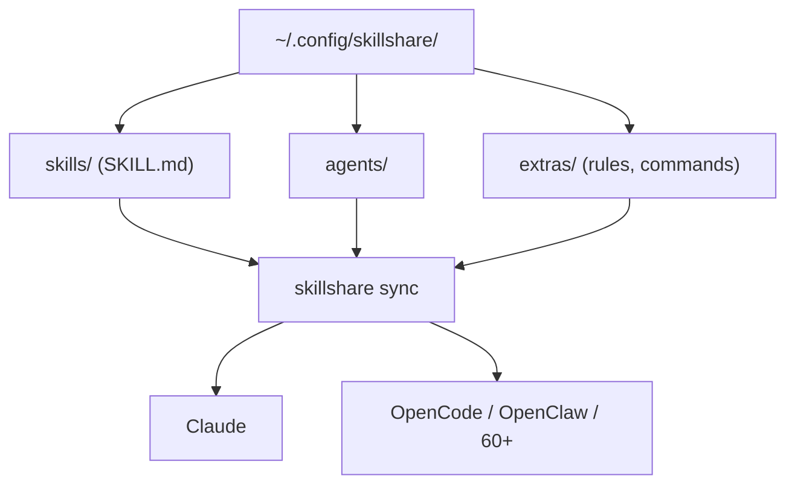

# runkids/skillshare

> Une source unique pour les skills, agents et règles de tous tes CLI d'IA, synchronisée partout.

## Le problème
Chaque CLI d'IA a son propre répertoire de skills. Tu édites dans l'un, tu oublies de copier
dans l'autre, et tu ne sais plus ce qui est où.

## Ce que ça fait vraiment
Tient un répertoire source (`~/.config/skillshare/` sur macOS/Linux, `%AppData%\skillshare\`
sur Windows) contenant `skills/`, `agents/` et `extras/`, puis crée des liens symboliques (ou
des jonctions NTFS sous Windows, sans droits admin) vers plus de 60 cibles : Claude, Codex,
Cursor, OpenCode, OpenClaw… Gère aussi les connexions MCP définies une fois et traduites dans
le format natif de chaque agent, les plugins complets (skills + hooks + réglages MCP), un
audit d'injection de prompt et d'exfiltration avant installation, et un filtrage fin via
`.skillignore`, le champ `targets` de `SKILL.md` et des include/exclude par cible.

## Comment c'est branché


## Essayer
```bash
curl -fsSL https://raw.githubusercontent.com/runkids/skillshare/main/install.sh | sh
skillshare init            # Create config, source, and detected targets
skillshare sync            # Sync skills to all targets
skillshare audit
skillshare ui
```

## Coût et pièges
Gratuit, binaire Go unique, aucun runtime Node, pas de registre, pas de télémétrie, marche
hors ligne. Si les liens symboliques posent problème, il faut basculer une cible en mode copie
avec `skillshare target <name> --mode copy`.

## Ce que ce n'est pas
Ce n'est pas un registre de skills : il ne fournit aucun contenu, il synchronise le tien.
L'audit de sécurité est un scan, pas une garantie. Le projet bouge vite (v0.21.0 annoncée dans
le README) et semble porté par une seule personne.

## Alternatives
- Les installateurs impératifs par commande (comparés dans le README) : plus simples, mais
  chaque skill est copiée indépendamment, sans source de vérité.

## Pour toi
Utile dès que tu jongles entre deux agents ou plus et que tes skills commencent à diverger.
