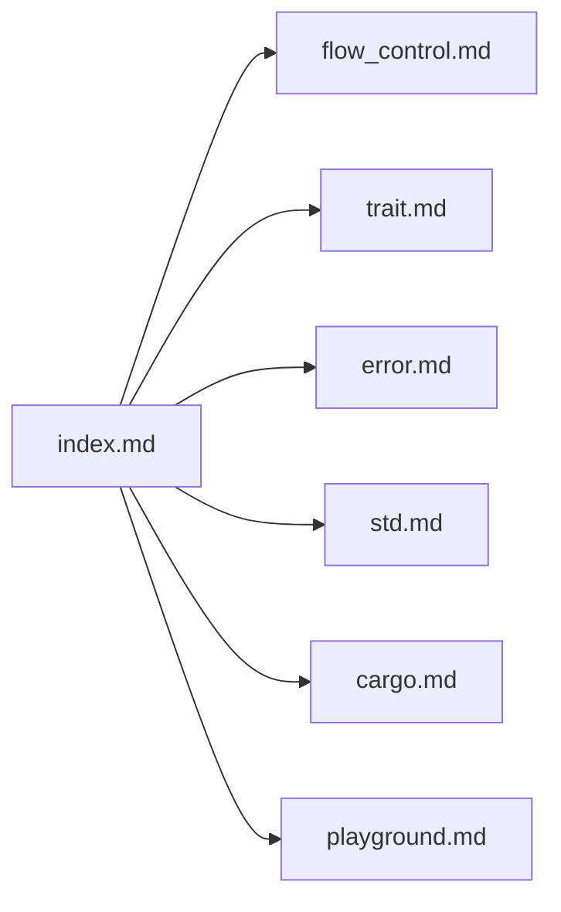

# rust-lang/rust-by-example

> Livre pour apprendre Rust par des exemples exécutables, avec éditeur en ligne.

## Le problème
Apprendre la syntaxe et les idiomes de Rust demande des exemples concrets que l'on peut modifier et lancer.

## Ce que ça fait vraiment
Livre mdBook couvrant les bases (formatage, variables, flux de contrôle, fonctions), types, génériques, traits, erreurs, conversions, bibliothèque standard, crates, Cargo, tests et Rust unsafe. Éditeur de code intégré pour lancer les exemples (connexion Internet requise). Traductions disponibles.

## Comment c'est branché


## Essayer
```bash
git clone https://github.com/rust-lang/rust-by-example
cd rust-by-example
cargo install mdbook
mdbook build
mdbook serve
```

## Coût et pièges
Gratuit. Lecture hors ligne possible ; exécuter les exemples demande Internet.

## Ce que ce n'est pas
Pas un cours de Rust pour la data science ni un outil.

## Alternatives
Aucune nommée dans le README.

## Pour toi
À surveiller : utile si tu apprends Rust pour de l'outillage performant ; sinon sans effet sur ton quotidien.

