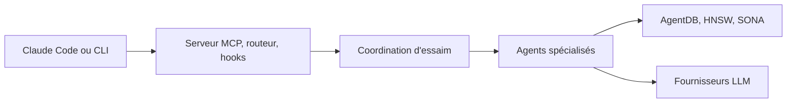

# ruvnet/claude-flow

> Ruflo, anciennement Claude Flow : couche d'orchestration d'agents pour Claude Code et Codex.

## Le problème
Claude Code seul travaille sans mémoire partagée ni coordination entre agents.

## Ce que ça fait vraiment
Ajoute à Claude Code un serveur MCP, des hooks, plus de 100 agents, des essaims coordonnés, une mémoire vectorielle (AgentDB, HNSW), un routage entre fournisseurs et un système de plugins (35 plugins). Deux voies d'installation : plugins légers (commandes slash) ou `npx ruflo init` (fichiers `.claude/`, hooks, démon). Interface web et planificateur d'objectifs hébergés en bêta.

## Comment c'est branché


## Essayer
```bash
npx ruflo@latest init wizard
claude mcp add claude-flow -- npx ruflo@latest mcp start
/plugin marketplace add ruvnet/ruflo
```

## Coût et pièges
Tokens des fournisseurs à ta charge, multipliés par les essaims. `init` écrit de nombreux fichiers dans le dépôt. Certaines commandes de fédération utilisent encore l'ancien nom `claude-flow`.

## Ce que ce n'est pas
Les chiffres (89 % de routage, gains de vitesse) viennent de l'auteur, sans reproduction ici. Le schéma d'architecture fourni décrit la v2 alpha et diffère du README actuel.

## Alternatives
Aucune alternative nommée dans le README au-delà de LangGraph, AutoGen et CrewAI, cités seulement comme comparaisons de benchmarks.

## Pour toi
À surveiller : ambition très large et projet mouvant d'une personne ; à tester en bac à sable, licence non déclarée.
