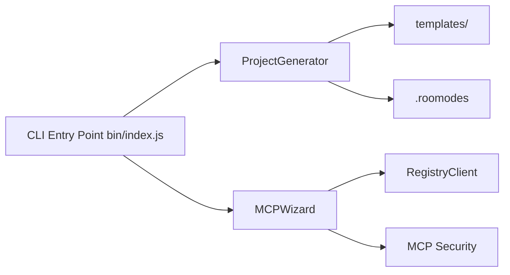

# ruvnet/rUv-dev

> Générateur de projets `create-sparc` qui configure Roo Code avec la méthode SPARC et des serveurs MCP.

## Le problème
Structurer un développement piloté par IA (spécification, architecture, tests, sécurité) demande de configurer à la main modes, règles et connecteurs.

## Ce que ça fait vraiment
Une CLI npx crée les fichiers `.roo` et `.roomodes` qui définissent des modes spécialisés (orchestrateur, architecte, testeur TDD, sécurité, DevOps, etc.). Trois gabarits : SPARC, AIGI (génération de code par IA) et un cadre Roo minimal. Un assistant MCP configure des serveurs (Supabase, OpenAI, GitHub, AWS, Firebase) avec références aux variables d'environnement, audit de sécurité et validation.

## Comment c'est branché


## Essayer
```bash
npx create-sparc init
npx create-sparc aigi init my-project
npx create-sparc minimal init my-project
npx create-sparc configure-mcp
```

## Coût et pièges
Requiert l'extension VS Code Roo Code et des modèles payants (Claude, GPT, DeepSeek) : coûts d'API à ta charge. Les serveurs MCP demandent des jetons (Supabase, GitHub…).

## Ce que ce n'est pas
Ce n'est pas un agent autonome : il ne fait que générer des fichiers de configuration pour Roo Code. Le README ne donne aucune mesure de qualité du code produit.

## Alternatives
Aucune alternative nommée dans le README.

## Pour toi
Surveiller : utile si tu utilises déjà Roo Code et veux un cadre de modes prêt à l'emploi ; sinon, c'est de la configuration qu'on réécrit soi-même.
