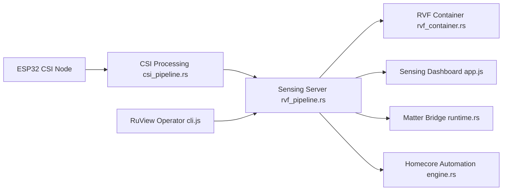

# ruvnet/wifi-densepose

> Plateforme de détection sans caméra : des capteurs ESP32 lisent le signal WiFi pour estimer présence, respiration et pose.

## Le problème
Mesurer présence et signes vitaux d'une pièce sans caméra ni objet porté, avec du matériel à quelques dollars. Les capteurs classiques demandent du câblage par pièce.

## Ce que ça fait vraiment
Des nœuds ESP32 capturent le CSI (Channel State Information) du WiFi. Un serveur Rust et des modules embarqués en tirent présence, comptage, chute, fréquences respiratoire et cardiaque, plus une pose à 17 points. Des intégrations Home Assistant (MQTT) et Matter exposent les états. Les chiffres publiés sont assortis d'aveux : présence 82,3 % (ancien « 100 % » retiré), modèle de pose embarqué à PCK@20 = 3 %, runtime encore un stub.

## Comment c'est branché


## Essayer
```bash
docker pull ruvnet/wifi-densepose:latest
docker run -p 3000:3000 ruvnet/wifi-densepose:latest
# puis http://localhost:3000 (données simulées)

pip install ruview
python archive/v1/data/proof/verify.py
```

## Coût et pièges
Le Docker tourne en données simulées ; le vrai CSI exige un ESP32-S3 (~9 $) ou une carte réseau de recherche, ~140 $ avec le Cognitum Seed. Le README mêle plusieurs produits (catalogue de 105 modules, plugin, MCP, boutique, programme d'affiliation).

## Ce que ce n'est pas
Pas un dispositif médical ni un système d'urgence : le README le dit lui-même, et vitaux comme pose demandent une validation indépendante. La pose en temps réel sur un seul ESP32 n'est pas démontrée. L'identification nominale d'une personne n'est pas revendiquée (non séparable sur WiFi seul). Supposer qu'on échappe à toute obligation de vie privée parce qu'il n'y a pas de caméra est un raccourci : la surveillance de personnes reste soumise au droit local (consentement, RGPD) ; à n'employer que sur des lieux et des personnes pour lesquels on a l'autorisation.

## Alternatives
- `ruvnet/rvcsi` : le runtime CSI seul, plus léger, cité dans le README.

## Pour toi
À surveiller plutôt qu'adopter : le volume d'ambitions, l'unique mainteneur et les écarts avoisinant les chiffres (pose 3 % en embarqué) justifient un test sur simulateur ou un banc ESP32 avant tout projet réel.

