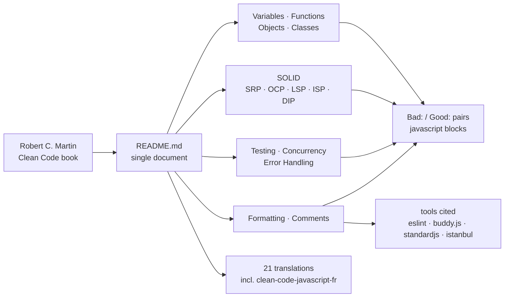

# ryanmcdermott/clean-code-javascript

> **Robert C. Martin's _Clean Code_ principles rewritten for JavaScript as bad/good code pairs.**

## The problem

The readability rules from _Clean Code_ were written for Java and think in classes, interfaces
and inheritance. Porting them to modern JavaScript — closures, promises, `Object.assign`,
destructuring — is translation work every team redoes on its own, usually conflating code style
with design.

## What it actually does

One Markdown document in eleven chapters: Variables, Functions, Objects and Data Structures,
Classes, SOLID, Testing, Concurrency, Error Handling, Formatting, Comments, and the list of
translations.

Every rule follows the same template: an imperative title ("Use searchable names",
"Function arguments (2 or fewer ideally)", "Prefer composition over inheritance"), a short
paragraph of reasoning, then a **Bad:** block and a **Good:** block of runnable JavaScript. Each
of the five SOLID principles gets its own section with a full worked example.

The README states up front what it is not: "This is not a style guide", and warns that not every
principle has to be followed strictly and even fewer are universally agreed upon. Anything
mechanisable is handed off to tooling — ESLint and `no-magic-numbers`, buddy.js for unnamed
constants, standardjs for formatting, istanbul for coverage — and the document keeps only what
requires judgement.

Twenty-one community translations are listed, including a French one
(`eugene-augier/clean-code-javascript-fr`).

## How it is wired

No code-derived diagram exists for this repository: the graph below is reconstructed from the
README alone. There is nothing to execute — the "machinery" is a document you read, which
delegates its mechanisable half to third-party tools.

## Trying it

The README documents **no commands** at all: no install step, no npm package, no script. There is
nothing to clone in order to use it — you open the page, read the chapter matching today's
problem, and paste the *Bad / Good* pair into a code review. The only commands a reader ends up
typing belong to the tools it links out to (ESLint, standardjs, istanbul), which are documented
elsewhere and therefore not reproduced here.

## Cost and gotchas

- **No cost, no dependency**: no API key, no GPU, no Docker, no account to create, no quota. The
  only investment is the time to read a long document.
- **The trap is dogmatic application.** The README itself warns that not every principle must be
  followed and few command consensus; turned into a blocking review rule, it produces exactly the
  sterile argument its Formatting chapter says to avoid.
- **No checker ships with it**: nothing is automated, no ESLint configuration is provided. The
  hidden cost is writing the matching rules yourself.
- **Translations are not maintained by the author**: the twenty-one listed repositories belong to
  third parties and may lag behind the English version.

## What it is not

- **Not a style guide** — the README says so outright. Indentation, quotes, semicolons: it points
  at automatic formatters and refuses the debate.
- **Not a library or an npm package**: nothing to install, nothing to import, no API. The
  repository holds prose and illustrative snippets, not code under test.
- **Not a neutral standard**: it is one author's reading of one book, and part of the advice
  (ES6 classes, method chaining, SOLID) assumes an object-oriented style that many JavaScript
  codebases do not share.

## Alternatives

| | When to prefer it |
|---|---|
| **eslint/eslint** | Cited in the README. Prefer it as soon as you want a rule *enforced* rather than read: ESLint checks continuously, clean-code-javascript can only persuade. Complementary, not competing. |
| **quii/learn-go-with-tests** | Same genre — clean-code pedagogy for one language — but in Go and driven by tests. Prefer it if your target language is Go, or if you learn by writing code rather than reading counter-examples. |
| **ryanmcdermott/3rs-of-software-architecture** | Linked from the introduction, same author: one level up, from the line of code to architecture (readable, reusable, refactorable). Prefer it when the question is about project structure, not about a function. |

The other catalogue neighbours (`pcottle/learnGitBranching`, `HKUDS/Vibe-Trading`, `yjs/yjs`)
are not comparable: Git, trading, CRDTs — nothing to do with a JavaScript design guide.

## For you

Useful but peripheral: on a data / AI / MLOps profile, JavaScript mostly shows up in dashboards
and small internal front-ends, which is precisely the code written fastest and worst. Two
chapters are worth reading even if you never write a line of JS — Functions and Error Handling —
because their arguments transfer verbatim to production Python. Watch it, do not adopt it as a
team reference: for model code, a Python guide pays off more directly.
