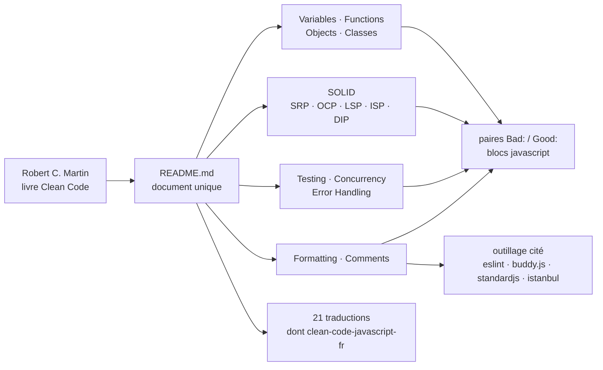

# ryanmcdermott/clean-code-javascript

> **Les principes du livre _Clean Code_ transposés en JavaScript, en paires « mauvais / bon » à lire.**

## Le problème

Les règles de lisibilité de Robert C. Martin sont écrites pour Java et raisonnent en classes,
interfaces et héritage. Les transposer soi-même à du JavaScript moderne — fermetures,
promesses, `Object.assign`, destructuration — demande un travail de traduction que chaque
équipe refait dans son coin, souvent en confondant style de code et conception.

## Ce que ça fait vraiment

Un unique document Markdown, découpé en onze chapitres : Variables, Fonctions, Objets et
structures de données, Classes, SOLID, Tests, Concurrence, Gestion des erreurs, Formatage,
Commentaires, puis la liste des traductions.

Chaque règle suit le même gabarit : un titre impératif (« Use searchable names »,
« Function arguments (2 or fewer ideally) », « Prefer composition over inheritance »), un
court paragraphe d'explication, puis un bloc **Bad:** et un bloc **Good:** en JavaScript
exécutable. Les cinq principes SOLID ont chacun leur section avec exemple complet.

Le README pose d'emblée ce qu'il n'est pas : « This is not a style guide », et annonce que
les principes ne sont pas à suivre strictement ni universellement approuvés. Il renvoie
l'automatisable à l'outillage — ESLint et `no-magic-numbers`, buddy.js pour les constantes non
nommées, standardjs pour le formatage, istanbul pour la couverture — et garde pour lui ce qui
relève du jugement.

Vingt et une traductions communautaires sont listées, dont une française
(`eugene-augier/clean-code-javascript-fr`).

## Comment c'est branché

Aucun diagramme tiré du code n'existe pour ce dépôt : ce schéma est reconstruit depuis le seul
README. Il n'y a pas de code à exécuter — la « mécanique » est celle d'un document qu'on lit et
dont on délègue la partie mécanisable à des outils tiers.

## Essayer

Le README ne documente **aucune commande** : ni installation, ni paquet npm, ni script. Rien à
cloner pour s'en servir — on ouvre la page, on lit le chapitre qui correspond au problème du
jour, on copie la paire *Bad / Good* dans une revue de code. Les seules commandes qu'un lecteur
finira par taper concernent les outils cités en renvoi (ESLint, standardjs, istanbul), qui ont
leur propre documentation ailleurs : elles ne figurent pas ici et ne sont donc pas reproduites.

## Coût et pièges

- **Zéro coût, zéro dépendance** : pas de clé d'API, pas de GPU, pas de Docker, pas de compte à
  créer, pas de quota. Le seul investissement est le temps de lecture d'un document long.
- **Le piège est l'application dogmatique.** Le README prévient lui-même que tous les principes
  n'ont pas à être suivis strictement et que peu font consensus ; transformé en règle de
  blocage en revue, le document produit exactement le genre d'argument stérile qu'il dit
  vouloir éviter au chapitre Formatage.
- **Pas d'outil de vérification fourni** : rien n'est automatisé, aucune configuration ESLint
  n'est livrée. Le coût caché est d'écrire soi-même les règles correspondantes.
- **Traductions non maintenues par l'auteur** : les vingt et un dépôts listés appartiennent à
  des tiers et peuvent retarder sur la version anglaise.

## Ce que ce n'est pas

- **Ce n'est pas un guide de style** — le README le dit en toutes lettres. Indentation, guillemets,
  points-virgules : le document renvoie aux formateurs automatiques et refuse d'en débattre.
- **Ce n'est pas une bibliothèque ni un paquet npm** : rien à installer, rien à importer, aucune
  API. Le dépôt ne contient que de la prose et des extraits illustratifs, non exécutés en tests.
- **Ce n'est pas un standard neutre** : c'est l'interprétation d'un livre par un auteur, et une
  partie des conseils (classes ES6, chaînage de méthodes, SOLID) suppose un style orienté objet
  que tous les projets JavaScript ne partagent pas.

## Alternatives

| | Quand le préférer |
|---|---|
| **eslint/eslint** | Cité dans le README. À préférer dès qu'on veut *faire respecter* une règle plutôt que la lire : ESLint la vérifie en continu, clean-code-javascript ne peut que convaincre. Les deux sont complémentaires, pas concurrents. |
| **quii/learn-go-with-tests** | Même genre — un dépôt de pédagogie du code propre en un langage donné — mais en Go et par les tests. À préférer si le langage cible est Go ou si l'on apprend mieux en écrivant du code qu'en lisant des contre-exemples. |
| **ryanmcdermott/3rs-of-software-architecture** | Renvoi de l'introduction, du même auteur : monte d'un cran, de la ligne de code à l'architecture (lisible, réutilisable, remaniable). À préférer quand la question porte sur la structure d'un projet, pas sur une fonction. |

Les autres voisins du catalogue (`pcottle/learnGitBranching`, `HKUDS/Vibe-Trading`, `yjs/yjs`)
ne sont pas comparables : Git, trading, CRDT — rien à voir avec un guide de conception JavaScript.

## Pour toi

Utile mais périphérique : sur un profil data / IA / MLOps, le JavaScript sert surtout aux
tableaux de bord et aux petits frontaux d'outils internes, et c'est précisément le code qu'on
écrit vite et mal. Deux chapitres valent le détour même sans écrire une ligne de JS — Fonctions
et Gestion des erreurs — parce que les arguments transposent tels quels au Python de production.
À surveiller, pas à adopter comme référence d'équipe : pour du code de modèle, un guide Python
est plus directement rentable.
