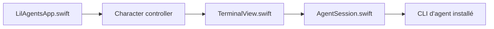

# ryanstephen/lil-agents

> Petits personnages animés sur le Dock macOS qui ouvrent un terminal pour discuter avec un agent IA.

## Le problème
Aucun problème de fond : c'est une interface ludique pour lancer des CLI d'agents depuis le Dock.

## Ce que ça fait vraiment
Deux personnages (Bruce et Jazz) marchent au-dessus du Dock ; un clic ouvre un terminal en popover branché sur Claude Code, Codex, Copilot ou Gemini CLI, au choix dans la barre de menus. Quatre thèmes, commandes `/clear`, `/copy`, `/help`, bulles de « réflexion », sons. Aucune donnée collectée par l'app ; mises à jour via Sparkle.

## Comment c'est branché


## Essayer
```bash
# Ouvrir lil-agents.xcodeproj dans Xcode puis lancer
npm install -g @openai/codex
npm install -g @google/gemini-cli
brew install copilot-cli
```

## Coût et pièges
Gratuit, mais il faut au moins une CLI d'agent installée, avec son propre compte ou abonnement. macOS 14+.

## Ce que ce n'est pas
Pas un agent : il habille des CLI existantes. Dernier push en avril 2026.

## Alternatives
Aucune alternative nommée dans le README.

## Pour toi
À ignorer : gadget d'interface sans valeur pour un travail data/MLOps, et peu actif depuis avril.

