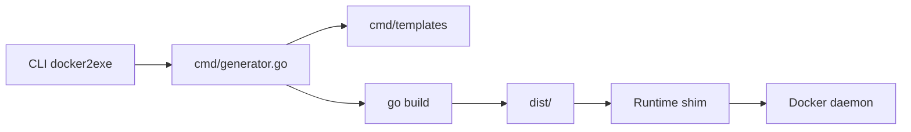

# rzane/docker2exe

> Convertit une image Docker en exécutable à envoyer à des collègues, sans qu'ils manipulent Docker.

## Le problème
Partager un outil packagé en image Docker oblige le destinataire à connaître les commandes `docker pull` et `docker run`.

## Ce que ça fait vraiment
Un programme Go génère un mini-projet à partir de gabarits (`cmd/templates`), puis le compile pour darwin, linux et windows dans `dist/`. Au lancement, l'exécutable vérifie la présence de l'image et fait `docker pull`. En mode `--embed`, l'image est sauvegardée en archive compressée et intégrée au binaire.

## Comment c'est branché


## Essayer
```bash
docker2exe --name alpine --image alpine:3.9
dist/alpine-darwin-amd64 cat /etc/alpine-release
docker2exe --name alpine --image alpine:3.9 --embed
```

## Coût et pièges
Docker requis sur la machine de build et d'exécution ; Go et gzip pour construire. Le mode embarqué convient aux petites images (exemple sous 10 Mo).

## Ce que ce n'est pas
Ce n'est pas un vrai packaging autonome : le destinataire doit avoir Docker. Aucune licence déclarée, donc droits d'usage incertains.

## Alternatives
- Aucune alternative nommée dans le README.

## Pour toi
Ignorer : peu maintenu (dernier push 2025-05-06), sans licence, et Docker reste requis chez le destinataire.
