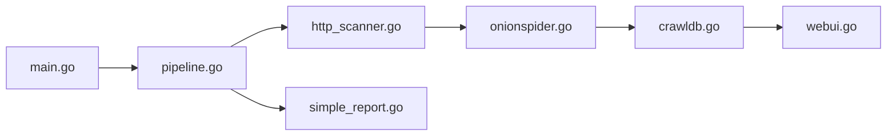

# s-rah/onionscan

> Scanner de services cachés Tor : fuites d'anonymat pour opérateurs, corrélations pour chercheurs.

## Le problème
Les services .onion trahissent souvent leurs opérateurs par erreur de configuration, non par faille de Tor.

## Ce que ça fait vraiment
Prend une adresse .onion, passe par le proxy SOCKS de Tor, lance des scans et un crawl web, extrait des identités (dont adresses Bitcoin), puis produit un rapport simple ou JSON. Une interface web, le « Correlation Lab », permet de chercher et d'étiqueter des corrélations.

## Comment c'est branché


## Essayer
```bash
go get github.com/s-rah/onionscan
onionscan notarealhiddenservice.onion
onionscan --verbose notarealhiddenservice.onion
onionscan --jsonReport notarealhiddenservice.onion
onionscan --torProxyAddress=127.0.0.1:9150 notarealhiddenservice.onion
```

## Coût et pièges
Gratuit. Le README exige Go 1.6 ou 1.7 : très ancien. Dernier push en août 2024.

## Ce que ce n'est pas
Pas un outil de désanonymisation de masse recommandé ; ses auteurs disent désapprouver certaines enquêtes. Licence « présente mais non identifiée ».

## Alternatives
Aucune citée dans le README.

## Pour toi
Hors périmètre data/IA, base de code ancienne et peu maintenue : ignorer.

