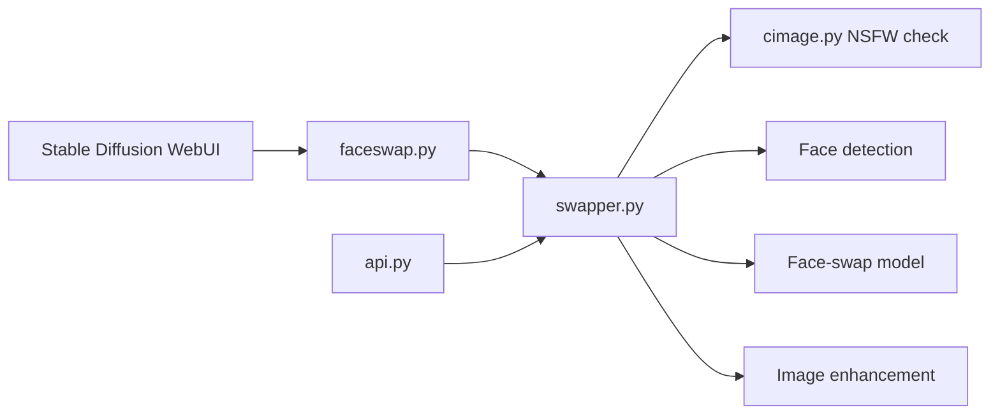

# s0md3v/roop

> Extension archivée pour l'interface web Stable Diffusion AUTOMATIC1111 : remplace un visage dans une image générée par un autre.

## Le problème
Remplacer un visage dans une image générée oblige sinon à entraîner un modèle dédié. Cette extension l'évite avec une simple image de référence.

## Ce que ça fait vraiment
- Se greffe sur l'interface web Stable Diffusion via un script (`faceswap.py`) : on fournit une image contenant un visage, on coche « Enable », le résultat généré porte ce visage.
- Le moteur (`swapper.py`) vérifie le contenu de la cible (`cimage.py`), détecte les visages, applique le modèle d'échange (`inswapper_128.onnx`), puis restaure ou agrandit l'image.
- Une API (`api.py`) expose l'échange d'image et la liste des modèles.
- L'auteur a arrêté le développement et archivé le dépôt : il dit que son regard sur les effets secondaires de ce type de logiciel a changé.

## Comment c'est branché


## Essayer
```bash
pip install insightface==0.7.3
# puis, dans web-ui : onglet Extensions > « install from URL »
# https://github.com/s0md3v/sd-webui-roop
# relancer web-ui ; si erreur 'NoneType' : placer inswapper_128.onnx dans /models/roop/
```

## Coût et pièges
Sous Windows, Visual Studio avec les paquets Python et C++ est requis. Le dépôt est archivé : aucun correctif à attendre, les 139 issues restent sans réponse.

## Ce que ce n'est pas
Ce n'est pas un outil maintenu. Il produit des deepfakes : le README demande de respecter la loi locale, d'obtenir le consentement de la personne dont le visage est utilisé et de signaler le contenu comme synthétique. Le filtre de contenu intégré est une protection partielle, pas une garantie. Licence AGPL-3.0 : obligations de publication du code en cas de service réseau.

## Alternatives
Aucune alternative nommée dans le README (il se dit basé sur le projet roop d'origine, développé séparément).

## Pour toi
Ignorer : archivé par son auteur pour des raisons éthiques, sans maintenance, et d'usage juridiquement sensible ; à ne regarder que comme référence historique de pipeline de face-swap.

