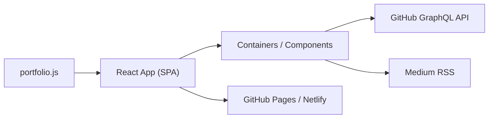

# saadpasta/developerFolio

> Modèle de portfolio React responsive pour développeurs, configurable via un seul fichier JavaScript.

## Le problème
Monter un site portfolio de zéro prend du temps pour un résultat souvent générique.

## Ce que ça fait vraiment
On édite `src/portfolio.js` (résumé, compétences, expérience, projets, blogs, contact) et `src/_globalColor.scss` pour les couleurs. Le site peut afficher les dépôts épinglés GitHub (GraphQL, jeton en `.env`), les articles Medium et une timeline Twitter. Déploiement via GitHub Pages/Actions ou Netlify, Docker possible.

## Comment c'est branché


## Essayer
```bash
git clone https://github.com/saadpasta/developerFolio.git
cd developerFolio
cp env.example .env
npm install
npm start
docker build -t developerfolio:latest .
docker run -t -p 3000:3000 developerfolio:latest
```

## Coût et pièges
Gratuit ; un jeton GitHub sans portée est requis pour afficher les projets. Dernier push fin 2024 (161 issues ouvertes), stack Create React App ancienne (Node 10 mentionné).

## Ce que ce n'est pas
Pas un CMS : tout passe par le code. Licence GPL-3.0, donc dérivés à redistribuer sous GPL.

## Alternatives
Aucune nommée dans le README.

## Pour toi
À ignorer : gabarit de vitrine web sans lien avec ton métier, et peu actif.

