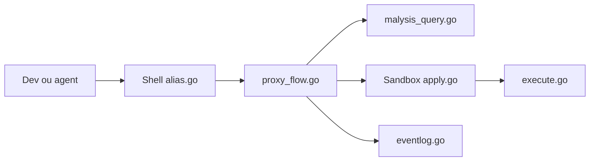

# safedep/pmg

> Pare-feu à l'installation qui bloque les paquets npm et pip malveillants avant exécution.

## Le problème
Chaque `npm install` ou `pip install` exécute du code non relu ; les compromissions de paquets populaires se multiplient.

## Ce que ça fait vraiment
S'intercale (alias shell, proxy) devant npm, pip, poetry : vérifie chaque paquet auprès de l'API communautaire gratuite de SafeDep, applique un délai de carence sur les versions récentes, peut sandboxer l'installation (Seatbelt, Landlock, Bubblewrap) et journalise un audit local. Action GitHub fournie pour la CI.

## Comment c'est branché


## Essayer
```bash
curl -fsSL https://raw.githubusercontent.com/safedep/pmg/main/install.sh | sh
pmg setup install
pmg setup doctor
npm install --no-cache --prefer-online safedep-test-pkg@0.1.3
```

## Coût et pièges
Gratuit, sans compte. Dépend de l'API SafeDep (les noms de paquets partent chez eux). Inspection HTTPS via une CA injectée ; télémétrie anonyme désactivable (`PMG_DISABLE_TELEMETRY=true`).

## Ce que ce n'est pas
Ne remplace pas les correctifs de CVE connues (pas de PR de remédiation). Détection limitée aux menaces déjà connues de la base.

## Alternatives
- safe-chain, Socket : comparés dans le README (Socket est fermé, sans sandbox).
- Snyk, Dependabot : pour les CVE, pas le blocage à l'installation.

## Pour toi
À adopter : protection peu coûteuse pour toi et tes agents qui installent des paquets, avec le compromis d'un appel à une API tierce.

