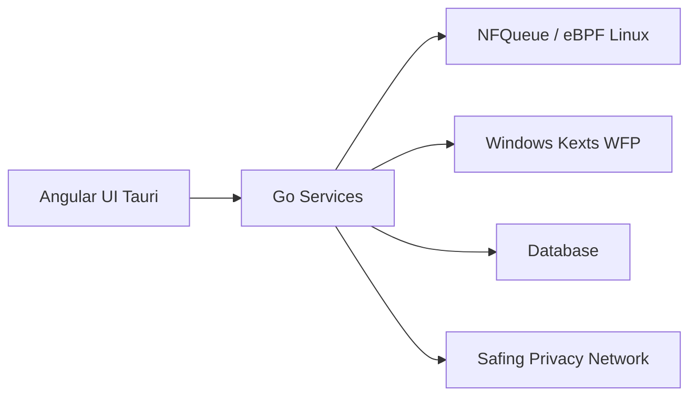

# safing/portmaster

> Pare-feu applicatif open source pour Windows et Linux qui surveille et filtre le trafic réseau par application.

## Le problème
Impossible de savoir quelles applications communiquent, ni de bloquer trackers et malwares sans réglages manuels.

## Ce que ça fait vraiment
Un service système Go intercepte les paquets (nfqueue sous Linux, pilote WFP sous Windows) et associe chaque connexion à son application (eBPF, `/proc`). Filtres par application, listes de blocage, DNS sécurisé DoH/DoT. Historique réseau, suivi de bande passante et SPN (réseau à sauts multiples) sont payants ($, $$). Interface Angular avec Tauri.

## Comment c'est branché


## Essayer
```bash
earthly +release
```
Le README annonce cette compilation comme « WIP » (Earthly et Docker requis) ; l'installation normale passe par le wiki.

## Coût et pièges
Fonctions de base gratuites ; historique, bande passante et SPN payants. Le SPN passe par des nœuds hébergés par Safing. Le README dit que l'UI utilise encore Electron.

## Ce que ce n'est pas
Pas un antivirus ni un VPN : c'est un pare-feu, le SPN se situe entre VPN et Tor.

## Alternatives
Aucune alternative citée dans le README.

## Pour toi
À surveiller : utile pour voir ce que tes outils IA envoient sur le réseau, mais copyleft GPL-3.0 et fonctions clés payantes.

