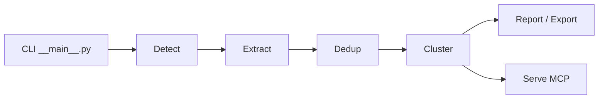

# safishamsi/graphify

> Transforme un projet (code, docs, PDF, images) en graphe de connaissances interrogeable depuis un assistant de code.

## Le problème
Un assistant relit ou greppe les fichiers à chaque question sur une base de code, sans vue d'ensemble.

## Ce que ça fait vraiment
Le code est analysé en local avec tree-sitter, sans LLM. Docs, PDF, images et vidéos passent par un modèle. Le graphe est regroupé en communautés et écrit dans `graph.json`, `graph.html` et `GRAPH_REPORT.md`. Chaque lien est étiqueté EXTRACTED ou INFERRED. Requêtes `query`, `path`, `explain`, et serveur MCP.

## Comment c'est branché


## Essayer
```bash
uv tool install graphifyy
graphify install
graphify query "what connects auth to the database?"
graphify hook install
```

## Coût et pièges
Le code seul se traite hors ligne. Pour docs et médias, il faut le modèle de la session ou une clé (Claude, OpenAI, Gemini, Ollama…). Le paquet PyPI s'écrit `graphifyy`. Un journal de requêtes local est prévu.

## Ce que ce n'est pas
Pas un index vectoriel : aucun embedding. Les liens INFERRED sont des déductions, pas des faits. Le catalogue ne déclare pas de licence.

## Alternatives
Le benchmark du README compare avec mem0 et supermemory pour la mémoire.

## Pour toi
À adopter en essai sur une base de code : le mode code seul est local et gratuit, et le graphe aide à explorer un projet inconnu.
