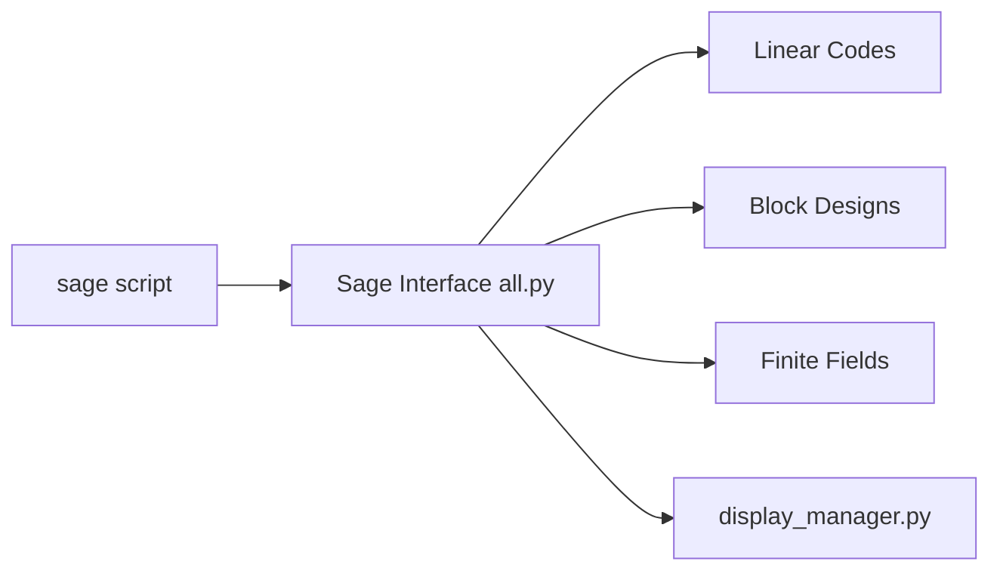

# sagemath/sage

> Système de mathématiques open source, alternative à Magma, Maple, Mathematica et MATLAB.

## Le problème
Les logiciels de calcul formel commerciaux sont chers et fermés.

## Ce que ça fait vraiment
Distribution de logiciel mathématique : une bibliothèque Python/Cython (algèbre, combinatoire, théorie des codes, corps finis…) et des dépendances compilées par un système de paquets (SPKG). Le README décrit surtout la compilation depuis les sources ; GPLv2+ annoncée dans le texte. Python 3.12 à 3.14 requis, plus de 10 Go de disque.

## Comment c'est branché


## Essayer
```bash
git clone -c core.symlinks=true --filter blob:none --origin upstream --branch develop --tags https://github.com/sagemath/sage.git
cd sage
make configure
./configure
make
./sage
```

## Coût et pièges
Compilation d'environ une heure sur une machine récente, 10 Go libres, 5 Go de RAM pour WSL ; ne pas compiler en root. Image Docker `sagemath/sagemath` disponible.

## Ce que ce n'est pas
Pas un paquet pip léger. La licence est signalée « non identifiée » par GitHub alors que le README annonce la GPLv2+.

## Alternatives
Aucune alternative nommée ; le README cite Docker ou le cloud pour éviter la compilation.

## Pour toi
À surveiller : utile pour des besoins de calcul symbolique ou de théorie des codes, mais l'installation lourde se justifie rarement pour du ML courant.

