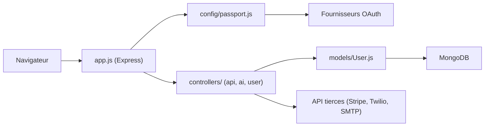

# sahat/hackathon-starter

> Modèle d'application web Node.js/Express avec authentification, exemples d'API tierces et démos IA, pour démarrer un hackathon.

## Le problème
Démarrer un projet web prend des heures : choix du framework, OAuth, formulaire de contact, comptes utilisateurs. Sans base commune, l'équipe ne peut pas contribuer tout de suite.

## Ce que ça fait vraiment
Fournit une application Express (MVC, vues Pug, Bootstrap 5.3) avec connexion locale, passkey, 2FA et OAuth (Google, GitHub, Microsoft…). Le modèle User est stocké dans MongoDB via Mongoose. Des contrôleurs montrent une vingtaine d'API tierces (Stripe, Twilio, Google Drive…). Côté IA : un agent ReAct LangChain/LangGraph avec sessions MongoDB, garde-fous d'entrée et streaming SSE, plus un exemple de RAG.

## Comment c'est branché


## Essayer
```bash
git clone https://github.com/sahat/hackathon-starter.git myproject
cd myproject
npm install
npm start
```

## Coût et pièges
MongoDB local ou Atlas ; le README précise que la recherche vectorielle des exemples IA exige Atlas, pas un MongoDB local. Chaque API tierce demande son compte et sa clé (certaines avec carte bancaire, ex. HERE Maps), l'agent IA utilise Groq.

## Ce que ce n'est pas
Ce n'est pas un framework à dépendre : on clone et on modifie. Les clés du dépôt sont des placeholders, et le README renvoie à une checklist séparée (PROD_CHECKLIST.md) avant toute mise en production. Le README décrit toutes les routes dans app.js par choix de simplicité.

## Alternatives
Aucune alternative citée dans le README.

## Pour toi
À surveiller : utile comme point de départ d'une démo web avec agent LangChain et RAG, mais pile Node/Mongo et couplage à Groq, loin d'un socle MLOps.

