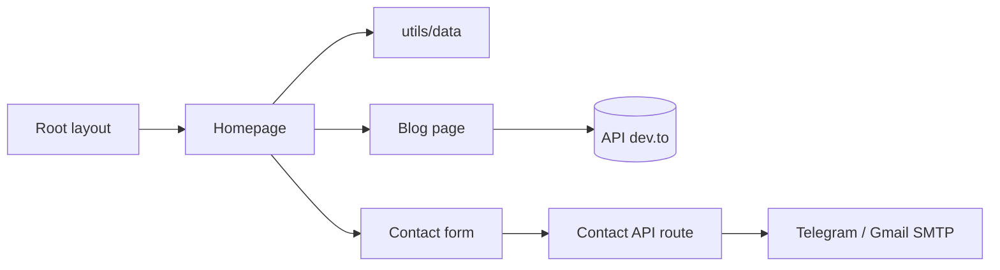

# said7388/developer-portfolio

> Modèle de site portfolio pour développeurs et freelances, en Next.js 16 et Tailwind.

## Le problème
Un développeur qui veut un portfolio en ligne repart souvent de zéro pour la mise en page, le blog et le formulaire de contact.

## Ce que ça fait vraiment
Un gabarit Next.js (App Router, React 19, Tailwind 4) piloté par des fichiers de données (`personal-data.js`, `projects-data.js`, etc.). Il propose sections héros, expérience, compétences, projets, blog alimenté par dev.to, formulaire de contact avec notification par Telegram et e-mail Gmail (nodemailer), reCAPTCHA et Google Tag Manager en option. Déploiement Vercel, Netlify ou Docker.

## Comment c'est branché


## Essayer
```bash
git clone https://github.com/<YOUR_GITHUB_USERNAME>/developer-portfolio.git
cd developer-portfolio
pnpm install
cp .env.example .env
pnpm dev
docker-compose up --build
```

## Coût et pièges
Node 18.17+ (20+ conseillé). Le formulaire exige un jeton Telegram ou un mot de passe d'application Gmail. Aucune licence déclarée : réutilisation juridiquement incertaine.

## Ce que ce n'est pas
Ce n'est pas un outil professionnel : c'est un modèle personnel à remplir avec ses propres données. Pas de tests documentés.

## Alternatives
Aucune alternative nommée dans le README.

## Pour toi
À ignorer : gabarit web sans rapport avec la data ou l'IA, et sans licence déclarée.

