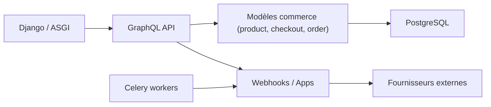

# saleor/saleor

> Back-end e-commerce headless, GraphQL uniquement, multi-canaux, pour équipes qui construisent une boutique sur mesure.

## Le problème
Les plateformes e-commerce monolithiques imposent leur pile technique et leurs plugins.

## Ce que ça fait vraiment
Expose une API GraphQL sur un noyau Django : catalogue, stocks multi-entrepôts, panier, commandes, promotions, paiements, taxes, expéditions. Extensions par webhooks, apps installées et plugins. D'après le code : ASGI, PostgreSQL, tâches Celery, Redis/SQS, adaptateurs Stripe, AvaTax, SendGrid. Le tableau de bord et la vitrine sont des dépôts séparés. La branche `main` peut être instable.

## Comment c'est branché


## Essayer
```bash
npm i -g @saleor/cli
saleor register
saleor storefront create --url {your-saleor-graphql-endpoint}
```

## Coût et pièges
Le code est gratuit, mais l'exploitation (PostgreSQL, Redis, workers, paiements) est à ta charge ; Saleor Cloud est le chemin rapide. Le README avoue que l'approche par services est plus lourde pour une petite boutique.

## Ce que ce n'est pas
Ce n'est pas une vitrine prête à l'emploi ni un CMS classique.

## Alternatives
WordPress et Magento sont cités comme approche traditionnelle plus rapide à démarrer.

## Pour toi
Ignorer : plateforme e-commerce sans lien avec la data ou l'IA.

