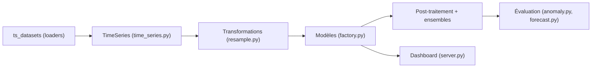

# salesforce/Merlion

> Bibliothèque Python de séries temporelles : prévision, détection d'anomalies et de ruptures ; archivée.

## Le problème
Comparer des modèles de séries temporelles entre jeux de données exige des interfaces et pipelines d'évaluation hétérogènes.

## Ce que ça fait vraiment
Interface unifiée pour modèles statistiques, arbres et deep learning en prévision, détection d'anomalies et ruptures, uni ou multivarié. Fournit `DefaultDetector` et `DefaultForecaster`, AutoML, régresseurs exogènes, post-traitement des scores d'anomalie, ensembles, évaluation simulant ré-entraînements périodiques, visualisation, tableau de bord cliquable et backend PySpark. `ts_datasets` charge NAB, M4, etc.

## Comment c'est branché


## Essayer
```bash
pip install salesforce-merlion
pip install "salesforce-merlion[dashboard]"
python -m merlion.dashboard
python benchmark_forecast.py --dataset M4_Hourly --model ETS
```

## Coût et pièges
Gratuit. Dépendances externes : OpenMP (lightgbm) et JDK 11 pour certains détecteurs. Dépôt archivé (dernier push mars 2026) : plus de maintenance, risque d'incompatibilité avec les versions récentes de numpy/pandas.

## Ce que ce n'est pas
Pas de support GPU (le README le met en « à venir », dans un projet archivé). Les comparaisons du tableau avec Prophet, Kats, darts etc. viennent des auteurs.

## Alternatives
Prophet, Kats, darts, statsmodels, nixtla, GluonTS, STUMPY (colonnes du tableau comparatif du README).

## Pour toi
Utile pour lire l'approche d'évaluation « déploiement simulé » ou reproduire des résultats ; pour un nouveau projet, préfère une bibliothèque maintenue.

