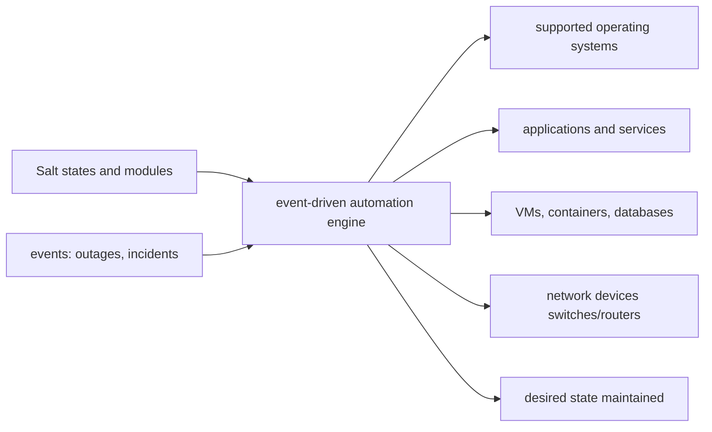

# saltstack/salt

> **A Python event-driven automation engine** for deploying, configuring and managing fleets of machines.

## The problem

Without configuration management, server state drifts: packages installed by hand, config
files diverging, routine operations repeated machine by machine. The README states the goal
directly: "ensuring consistent configuration and preventing configuration drift".

## What it actually does

Salt is described as an event-driven automation tool and framework, built on Python. Its
stated uses: managing operating system deployment and configuration, installing and
configuring software applications and services, managing servers, virtual machines,
containers, databases, web servers and network devices such as switches and routers from
several vendors. Beyond configuration management, the README also claims orchestration of
routine IT processes (scheduled downtimes, OS or application upgrades) and systems that can
respond automatically to outages or other events. Extension happens through execution
modules and state modules written by the community. Internal mechanics are not documented in
this README.

## How it is wired

No code-derived diagram exists for this repository; the graph below only names the pieces
the README itself mentions.



## Trying it

The README contains no installation or usage command: it points to the Salt install guide
and to the Broadcom package repositories (RPM, DEB, generic). Its only command-line note is
a usage caveat:

```text
When using "salt-cloud -p" with a profile, pass only the VM name on the command line.
Specify VM attributes (memory, cpu, vcpu, etc.) in the profile configuration, not as
command-line arguments.
```

## Cost and gotchas

The code is Apache 2.0 and packages are distributed free of charge. The README mentions no
API key, no third-party service and no telemetry. Two documented points deserve attention:
the project is sponsored and managed by Broadcom (SaltStack acquired by VMware in 2020,
VMware by Broadcom in 2023), and many core contributors are Broadcom employees; and Salt
publishes recurring security announcements, with a dedicated RSS feed the project recommends
subscribing to — this is a component that must be kept current. Installation relies on
packages hosted on packages.broadcom.com.

## What it is not

It is not a declarative cloud provisioning tool in the sense of Terraform or Pulumi: Salt
manages the state of machines and services, not the lifecycle of cloud resources reconciled
against remote state. It is also not the commercial product: VMware Salt (formerly Aria
Automation Config / SaltStack Config) is a separate Broadcom product built on this code.
Finally, the README documents neither the master/minion architecture, nor machine
requirements, nor a single getting-started command: everything is deferred to external
documentation, so it is not enough to pick the tool up.

## Alternatives

- **hashicorp/terraform** — for creating and versioning infrastructure resources rather than
  maintaining the internal state of machines that already exist.
- **pulumi/pulumi** — the same ground as Terraform, using general-purpose programming
  languages instead of a dedicated one.
- **crossplane/crossplane** — if the target is Kubernetes and resources are driven by
  controllers rather than by an operations agent.

## Why it matters to you

Indirect value for a data/AI profile: Salt remains a long-proven way to keep compute fleets
in a known state (drivers, packages, services) without going through Kubernetes. But the
automation ecosystem has moved on, governance is corporate, and the README offers no
practical entry point — worth knowing if you inherit a Salt-managed estate, not a starting
choice.
