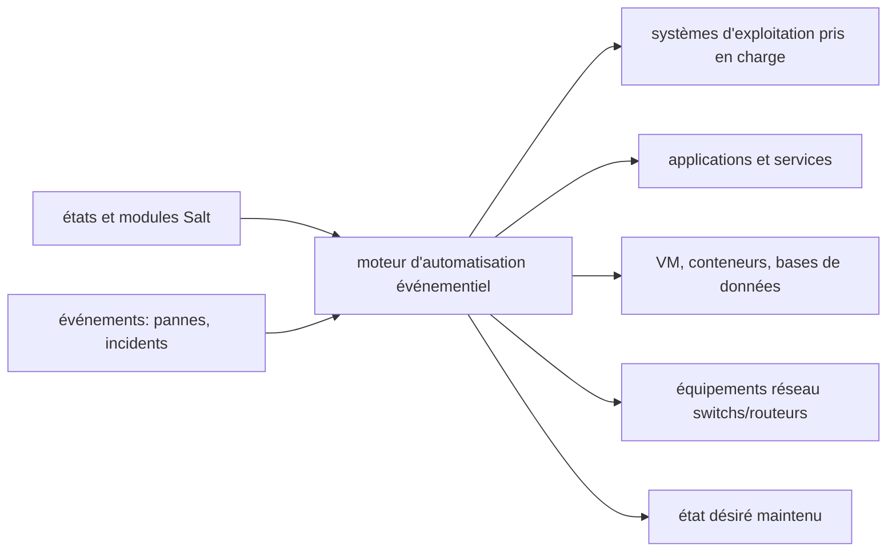

# saltstack/salt

> **Moteur d'automatisation événementiel en Python** pour déployer, configurer et gérer des parcs de machines.

## Le problème

Sans outil de gestion de configuration, l'état des serveurs dérive : paquets installés à la
main, fichiers de conf divergents, tâches d'exploitation répétées machine par machine. Le
README nomme explicitement ce point : « ensuring consistent configuration and preventing
configuration drift ».

## Ce que ça fait vraiment

Salt est décrit comme un outil et un framework d'automatisation piloté par événements, bâti
sur Python. Ses usages annoncés : déploiement et configuration du système d'exploitation,
installation et configuration d'applications et de services, gestion de serveurs, VM,
conteneurs, bases de données, serveurs web et équipements réseau (switchs, routeurs de
plusieurs constructeurs). Au-delà de la gestion de configuration, le README annonce
l'orchestration de processus d'exploitation récurrents (fenêtres de maintenance, montées de
version) et la construction de systèmes capables de réagir automatiquement à une panne ou à
un événement. L'extensibilité passe par des modules d'exécution et des modules d'état écrits
par la communauté. Le détail du fonctionnement interne n'est pas documenté dans ce README.

## Comment c'est branché

Aucun diagramme tiré du code n'est disponible pour ce dépôt ; le schéma ci-dessous ne reprend
que les pièces nommées dans le README.



## Essayer

Le README ne contient aucune commande d'installation ni d'utilisation : il renvoie au *Salt
install guide* et aux dépôts de paquets Broadcom (RPM, DEB, générique). La seule indication
en ligne de commande est une note d'usage :

```text
Avec « salt-cloud -p » et un profil, ne passer que le nom de la VM sur la ligne de commande.
Les attributs de la VM (mémoire, cpu, vcpu, etc.) se déclarent dans la configuration du
profil, pas en arguments de ligne de commande.
```

## Coût et pièges

Le code est sous Apache 2.0 et la distribution des paquets est gratuite. Le README ne
mentionne ni clé d'API, ni service tiers, ni télémétrie. Deux points de vigilance qu'il
documente lui-même : le projet est sponsorisé et géré par Broadcom (SaltStack racheté par
VMware en 2020, VMware par Broadcom en 2023), et une part des contributeurs cœur sont des
salariés Broadcom ; par ailleurs Salt fait l'objet d'annonces de sécurité régulières, avec
un flux RSS dédié auquel le projet recommande de s'abonner — c'est un composant à tenir à
jour. L'installation dépend des paquets hébergés sur packages.broadcom.com.

## Ce que ce n'est pas

Ce n'est pas un outil de provisioning d'infrastructure cloud déclaratif au sens de Terraform
ou Pulumi : Salt gère l'état des machines et des services, pas la création d'un inventaire de
ressources cloud à partir d'un état distant. Ce n'est pas non plus le produit commercial :
VMware Salt (ex-Aria Automation Config / SaltStack Config) est un produit Broadcom distinct
bâti sur ce code. Enfin, le README ne documente ni l'architecture master/minion, ni les
prérequis machine, ni la moindre commande de démarrage : tout est renvoyé vers la
documentation externe, il ne suffit pas à prendre l'outil en main.

## Alternatives

- **hashicorp/terraform** — pour créer et versionner des ressources d'infrastructure plutôt
  que pour maintenir l'état interne de machines déjà existantes.
- **pulumi/pulumi** — même terrain que Terraform, avec des langages de programmation
  généralistes au lieu d'un langage dédié.
- **crossplane/crossplane** — si la cible est Kubernetes et le pilotage des ressources par
  des contrôleurs plutôt que par un agent d'exploitation.

## Pour toi

Intérêt indirect pour un profil data/IA : Salt reste un moyen éprouvé de maintenir dans un
état connu des flottes de machines de calcul (drivers, paquets, services) sans passer par
Kubernetes. Mais l'écosystème d'automatisation s'est déplacé, la gouvernance est
d'entreprise, et le README ne donne aucun point d'entrée pratique — à connaître si l'on
hérite d'un parc déjà géré par Salt, pas à choisir pour démarrer.
