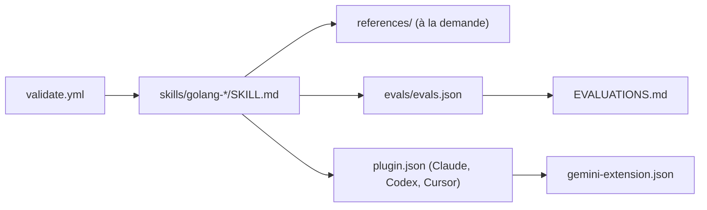

# samber/cc-skills-golang

> Pack de skills Go pour agents de code (Claude Code, Codex, Gemini, Cursor…), chargés à la demande.

## Le problème
Un agent de code écrit du Go passable mais ignore les conventions (erreurs, nommage, tests, sécurité) et les bibliothèques courantes. Sans règles, on corrige les mêmes défauts à chaque session.

## Ce que ça fait vraiment
Environ 50 dossiers `skills/golang-*`, chacun avec un `SKILL.md` (déclencheur + consignes) et des `references/` chargées seulement si nécessaire. Couvre style, tests, sécurité, observabilité, DI (wire, dig, fx) et les bibliothèques samber/*. Des manifestes de plugin exposent le pack à Claude, Codex, Cursor et Gemini. Le README affiche une évaluation : 3348/3439 avec skill contre 1957/3439 sans (mesure de l'auteur, non vérifiée).

## Comment c'est branché


## Essayer
```bash
npx skills add https://github.com/samber/cc-skills-golang --all
# ou une seule skill :
npx skills add https://github.com/samber/cc-skills-golang --skill golang-performance
/plugin marketplace add samber/cc
/plugin install cc-skills-golang@samber
```

## Coût et pièges
Gratuit, aucune clé. Le README dit qu'installer un sous-ensemble donne une vue incohérente : les skills se renvoient les unes aux autres. Les descriptions restent chargées en permanence (~1 100 tokens pour les skills recommandées).

## Ce que ce n'est pas
Ce n'est pas un outil Go : c'est de la documentation pour agent. Ne couvre pas le workflow git/CI/PR (renvoie vers un autre pack). Les gains annoncés viennent des évals de l'auteur.

## Alternatives
Le README renvoie vers `cc-skills` (samber) pour les skills hors Go.

## Pour toi
Ignorer : la stack Go est hors de ton profil data/IA/MLOps ; garde seulement l'idée d'un pack de skills évalué avec/sans, réutilisable pour Python.
