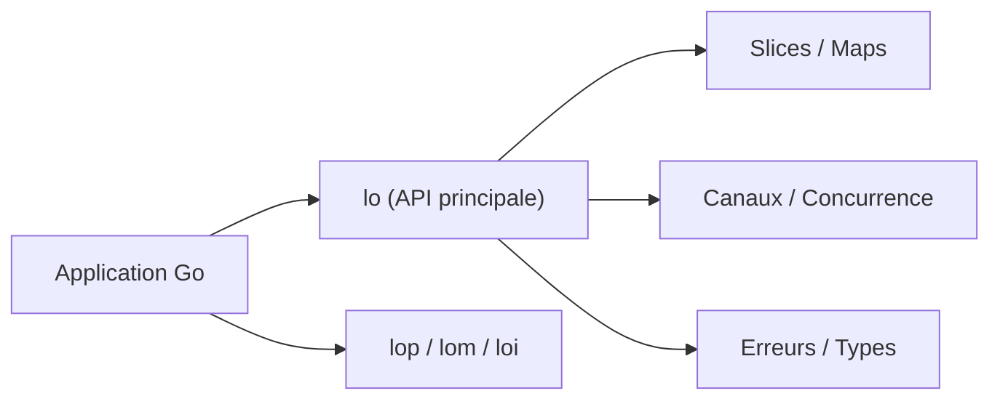

# samber/lo

> Bibliothèque Go de type Lodash, fondée sur les génériques, pour manipuler slices, maps et canaux.

## Le problème
Les boucles de filtrage, mapping et regroupement en Go sont verbeuses, surtout depuis l'arrivée des génériques.

## Ce que ça fait vraiment
Des dizaines d'helpers typés : `Filter`, `Map`, `Reduce`, `GroupBy`, `Chunk`, `Uniq` pour les slices ; clés et valeurs pour les maps ; mathématiques et chaînes ; tuples ; canaux (`FanIn`, `FanOut`, `Buffer`) ; recherche, conditions, gestion d'erreurs (`Must`, `Try`) ; concurrence (`Debounce`, `Throttle`, `Attempt`). Sous-paquets `parallel`, `mutable`, `it`. Sans dépendance hors bibliothèque standard, semver strict en v1.

## Comment c'est branché


## Essayer
```bash
go get github.com/samber/lo@v1
npx skills add https://github.com/samber/cc-skills-golang --skill golang-samber-lo
```

## Coût et pièges
Gratuit. Go 1.18 ou plus. Le README note que `lo.Map` est environ 4 % plus lent qu'une boucle `for` et que `lop.Map` alloue davantage : à réserver aux traitements longs.

## Ce que ce n'est pas
Pas du traitement de flux infini : le README renvoie pour cela à `samber/ro`. Quelques helpers recoupent `slices` et `maps` de la bibliothèque standard.

## Alternatives
`samber/ro` pour les flux d'événements, `samber/do` pour l'injection de dépendances, `samber/mo` pour les monades (tous nommés dans le README).

## Pour toi
Ignorer, sauf si ton pipeline ou tes outils MLOps sont en Go : rien ici ne touche à Python ni aux modèles.

