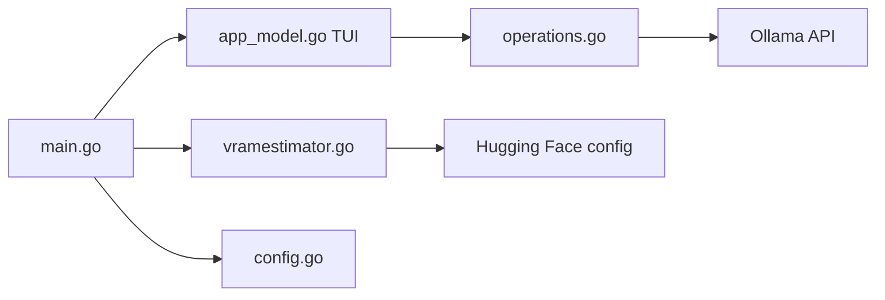

# sammcj/gollama

> Interface terminal pour lister, trier, éditer et supprimer les modèles Ollama, avec estimation de vRAM.

## Le problème
Nettoyer et inspecter de nombreux modèles Ollama en ligne de commande est fastidieux.

## Ce que ça fait vraiment
TUI Go : liste avec taille, quantisation et famille, tri, inspection, copie, suppression, édition de Modelfile, exécution et déchargement de modèles, envoi vers un registre, vue des modèles en cours. Un estimateur de vRAM calcule mémoire, contexte maximal et meilleure quantisation pour un modèle Ollama ou Hugging Face. Thèmes et config JSON.

## Comment c'est branché


## Essayer
```bash
go install github.com/sammcj/gollama/v2@latest
gollama
gollama --vram llama3.1:8b-instruct-q6_K
```

## Coût et pièges
Gratuit, Ollama requis. L'auteur annonce un ralentissement de la maintenance (décembre 2025) et l'abandon du lien LM Studio depuis la v2.0.1 ; il n'utilise plus guère Ollama.

## Ce que ce n'est pas
Pas un serveur de modèles. La détection CUDA de la vRAM est marquée « à venir ».

## Alternatives
Aucune alternative nommée dans le README (l'auteur cite llama.cpp avec llama-swap et LM Studio pour servir des modèles).

## Pour toi
À surveiller : utile si tu accumules des modèles Ollama, et l'estimateur de vRAM se démarque, mais l'auteur ralentit le projet.

