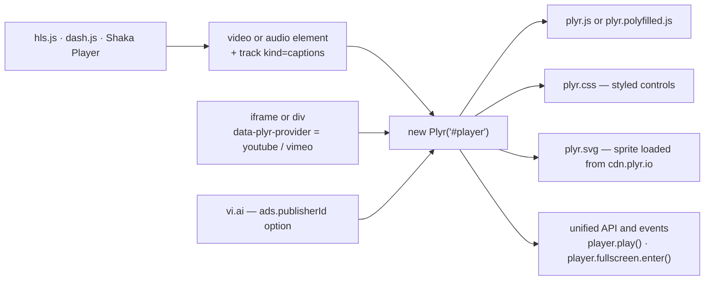

# sampotts/plyr

> **An HTML5, YouTube and Vimeo media player you style yourself, for a regular website.**

## The problem

Native `<video>` and `<audio>` controls cannot be styled and differ between browsers, while
YouTube and Vimeo each impose their own iframe, API and events. Without a common layer you
write three integrations and lose accessibility along the way.

## What it actually does

Plyr replaces the controls with plain HTML — `<input type="range">` for volume, `<progress>`
for progress, real `<button>` elements — which you style in CSS, with no filler markup or
`<a href="#">` tricks.

It enhances existing markup progressively: a `<video>`, an `<audio>`, or a YouTube/Vimeo
`<iframe>` (or a `<div>` carrying `data-plyr-provider` and `data-plyr-embed-id`) becomes a
player after `new Plyr('#player')`.

It unifies the API and events: the same methods (`player.play()`,
`player.fullscreen.enter()`), setters and getters apply to all three sources, so you never
touch the Vimeo or YouTube APIs directly.

It handles VTT captions and screen readers, preview thumbnails (`previewThumbnails`, VTT files
you generate yourself), fullscreen, responsive layout, and an optional ad mode wired to vi.ai.

It does not decode streams itself: streaming playback goes through hls.js, dash.js or Shaka
Player, for which the README provides example integrations.

## How it is wired

No code-derived diagram exists for this repository; the graph below is reconstructed from the
README alone.



## Trying it

```bash
# The README documents no package install command;
# the only command it gives is a build from source.
npm i && npm run build
```

The documented path involves no shell at all: the ES module `import Plyr from 'plyr';` then
`const player = new Plyr('#player');`, or the prebuilt CDN files:

```html
<script src="https://cdn.plyr.io/3.8.4/plyr.js"></script>
<link rel="stylesheet" href="https://cdn.plyr.io/3.8.4/plyr.css" />
```

## Cost and gotchas

- **Free, MIT licensed**, no API key or account needed for the player itself.
- **CDN dependency by default**: the SVG sprite is loaded automatically from `cdn.plyr.io`
  (Cloudflare), putting a third party in the render path of every page. The README says this
  can be changed through the options, or the files self-hosted (downloaded from the CDN or
  unpkg, or built with `npm i && npm run build` into `dist`).
- **Polyfills are your job**: Plyr is written in ES6 and the project deliberately ships none;
  IE10/IE11 require them. A `plyr.polyfilled.js` build exists.
- **iPhone**: mobile Safari forces the native player for `<video>` without the `playsinline`
  attribute, and volume controls are disabled device-wide.
- **Poster**: use `data-poster`, not `poster`, or the image is downloaded twice.
- **Monetization**: ads require a vi.ai account and a `publisherId`; the README sends billing
  questions to vi.ai, not to the project.
- **Preview thumbnails**: the VTT files and images must be generated by you.

## What it is not

- **Not a project to start today.** The banner at the top of the README states that the people
  behind Plyr, Vidstack and Media Chrome have merged into the latest Video.js, and that "Plyr
  will soon be deprecated". That is the dominant fact here.
- **Not a playback engine**: no decoding, no HLS or DASH of its own. Streaming comes from
  hls.js, dash.js or Shaka; Plyr is the skin and the API on top.
- **Not a video host** or transcoder: the README points to Mux for hosting. The React, Vue,
  Angular and Svelte components and the CMS plugins are maintained by third parties, not by
  this repository.

## Alternatives

| | When to prefer it |
|---|---|
| **videojs/video.js** | Recommended by the README itself as the successor: the version absorbing Plyr, Vidstack and Media Chrome. Prefer it for anything new; stay on Plyr only for an existing setup that works. |
| **paypal/accessible-html5-video-player** | Credited as the project Plyr was originally ported from. Relevant only if you want a minimal accessible player with no YouTube or Vimeo support. |

The integrations named in the README (hls.js, dash.js, Shaka Player) are not alternatives but
complements: they provide the stream that Plyr dresses up.

## For you

Little to do with data or MLOps, except on one practical point: publishing demo videos,
experiment recordings or interview captures on a project page or documentation site, with
captions and a consistent player everywhere. For that narrow case, go straight to Video.js,
since the repository announces its own end.
